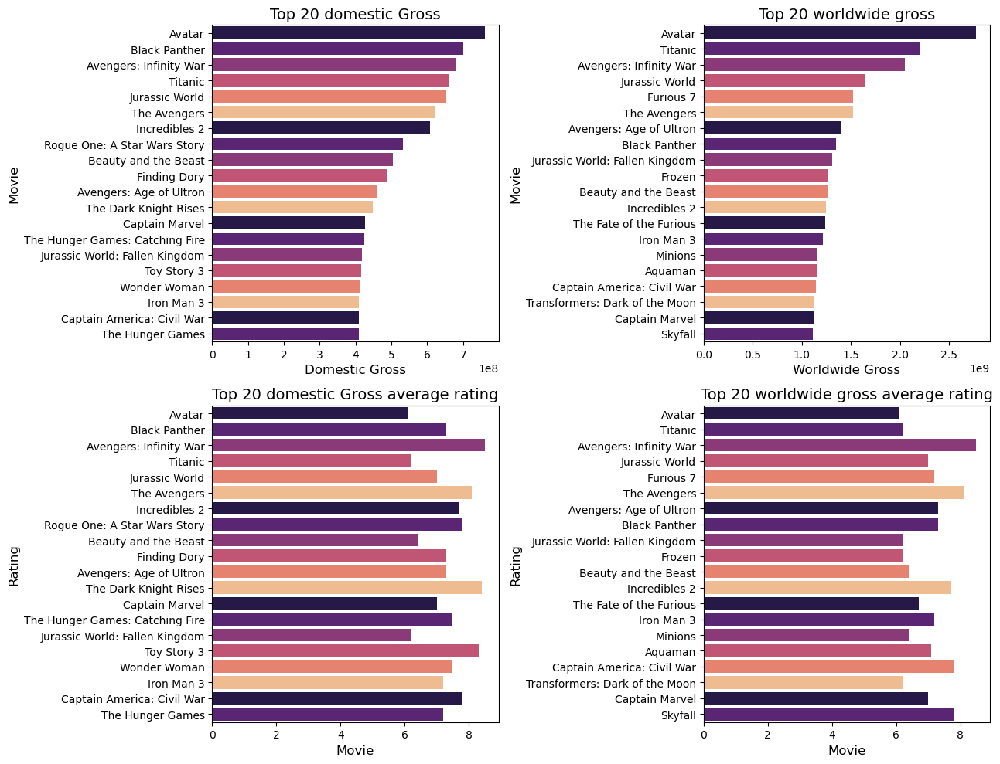
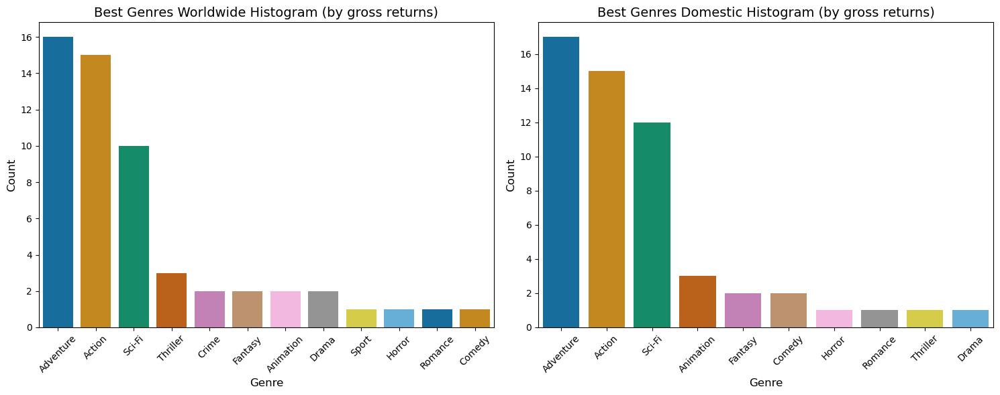
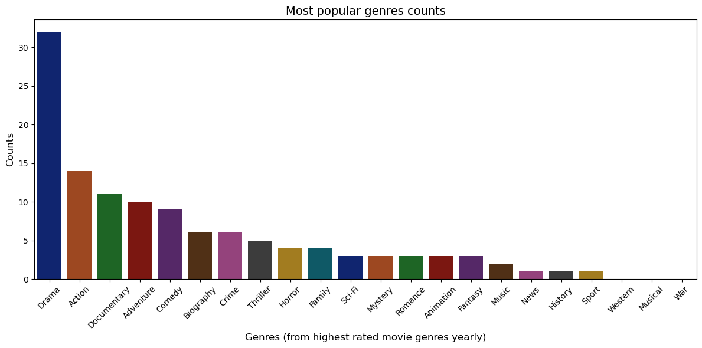
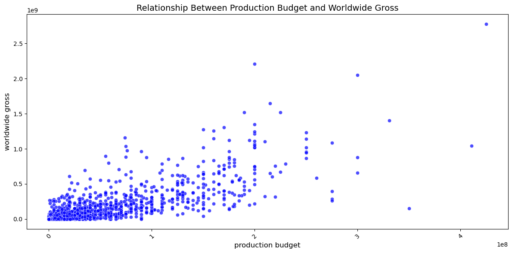
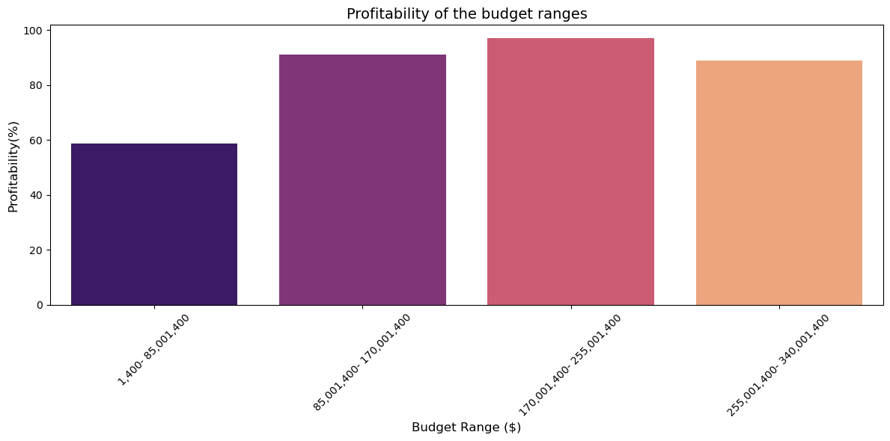
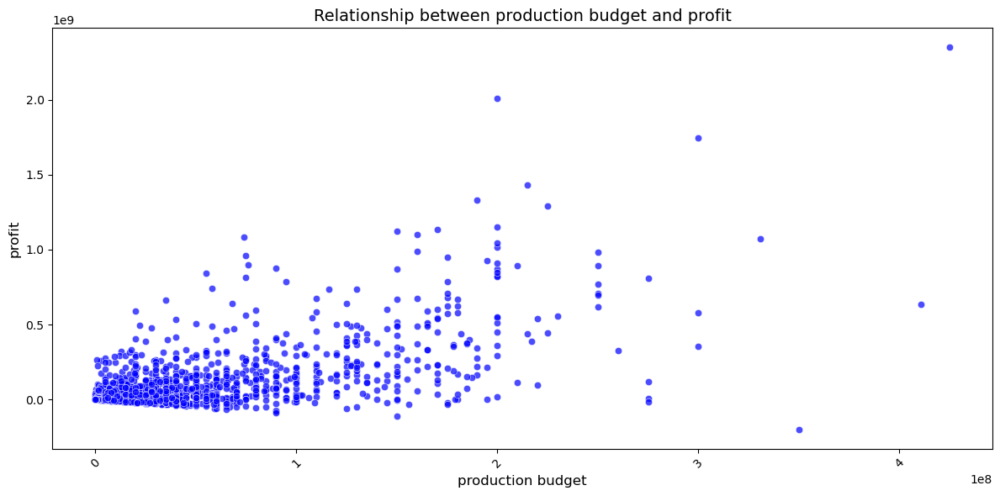
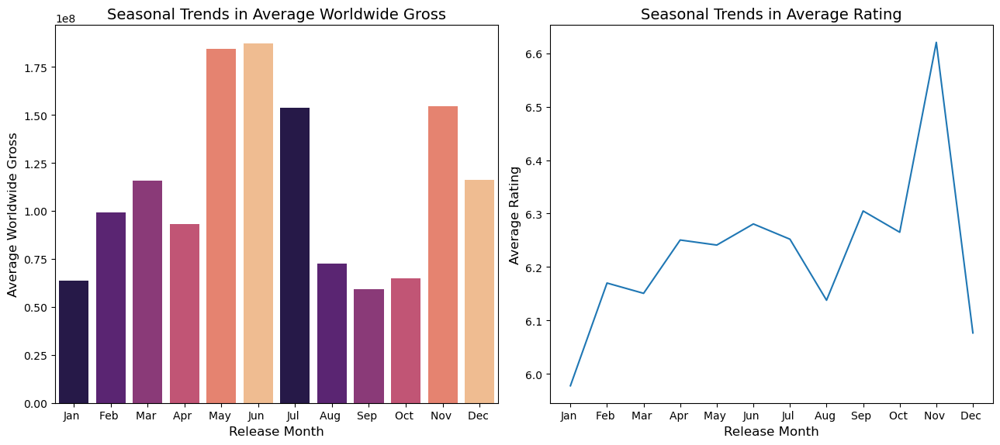
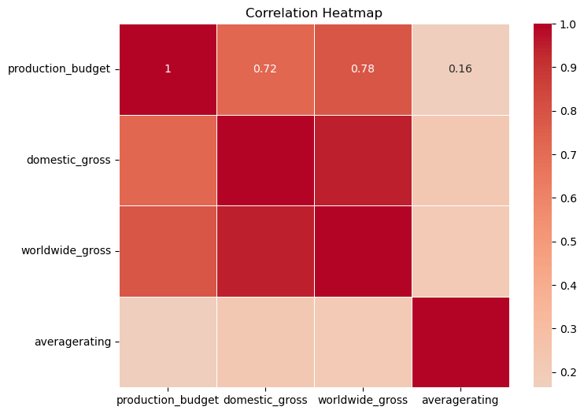
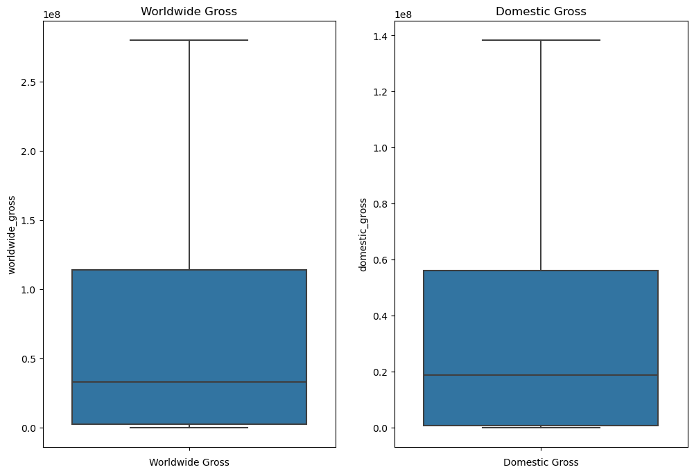

# Movie-Studio-Blueprint

## Overview

This project leverages data from [Box Office Mojo](https://www.boxofficemojo.com), [IMDb](https://www.imdb.com/), [The Numbers](https://www.the-numbers.com/), [TheMovieDB](https://www.themoviedb.org/) and [Rotten Tomatoes](https://www.rottentomatoes.com/) to define Microsoft's New Movie Studio Strategy. 
It sees all the big companies creating original video content and they want to get into the lucrative business prospects. 
Microsoft decided to create a new movie studio based on scientific facts through data analysis.
Here are the insights following the **exploratory data analysis** conducted:
- The movie genres **Action, Adventure & Drama** are the most popular.
- The safest budget range is ***$170,001,400$ - $255,001,400$***,  with the highest profitability index of *96.96%*.
- Summer months ***(June, July, and August)*** show strong performance in terms of both average worldwide gross and
average rating.

An overview of research recommendations include:
- **Focus on Popular Genres**: Allocate resources to produce movies in genres that are currently performing well based on box office gross and audience ratings. This can increase the likelihood of commercial success and positive audience reception.
- **Optimize Release Timing**: Use the insights from seasonal trends to strategically plan movie releases.
- **Collaborate with Industry Experts**: Engage with industry experts and professionals to complement data-driven insights with creative expertise and market knowledge, ensuring a well-rounded approach to movie production. 
***
## Business Problem

Microsoft wants a piece of the cake in the movie industry, however, it is limited in the domain knowledge. The research was done based on the following research questions:
1. Which are the **top performing movie genres**?
1. What are the **preferences** of the **target audience**?
1. How to **break market barriers**?

The following are the **data questions** answered in this analysis:

**1. What types of films are currently performing best at the box office (based on box office gross)?**
- What are the characteristics of top-performing movies based on box office gross?
- Which movies have been the most successful financially?

**2. Which movie genres have been the most popular and successful over time?**
- What are the trends in genre preferences?
- What are the preferences of the target audience based on user ratings and reviews? 
- What type of content resonates well with the audience?

**3. How does the movie budget impact box office revenue, and can smaller budget films be profitable?**
- How does the movie budget affect box office revenue? 
- Can smaller budget films be profitable, and is there an optimal budget range?

**4. Are there seasonal trends in movie performance, and when is the best time to release a movie?**
- Are there seasonal patterns in movie performance? 
- When is the best time to release a movie for maximum revenue?
***
## Data Understanding

The research retrieves information from Box Office Mojo, The Numbers and IMDb databases.

**Data Description**:
The data used for this project comes from multiple movie-related datasets from the following sources:

1. **IMDb (Internet Movie Database)**:
    - **IMDb Basics**:
       - Dataset: imdb.title.basics
       - Description: Contains basic movie information like **movie_id, primary_title, original_title, start_year,
         runtime_minutes, genres**
       - Relationship to Data Analysis Questions: Provides information on movie genres and basic movie details required for genre analysis.

    - **IMDb Ratings**:
       - Dataset: imdb.title.ratings
       - Description: Contains **'movie_id', 'averagerating', 'numvotes'**
       - Relationship to Data Analysis Questions: Allows us to explore audience preferences based on user ratings and reviews.

2. **Box Office Mojo**:
   - Dataset: bom.movie_gross
   - Description: Contains box office gross information for movies. \
   i.e **'title', 'studio', 'domestic_gross', 'foreign_gross', 'year'**
   - Relationship to Data Analysis Questions: Essential for analyzing box office success and financial performance of movies.

3. **The Numbers**:
   - Dataset: tn.movie_budgets
   - Description: Contains movie financials, like **'id', 'release_date', 'movie', 'production_budget', 'domestic_gross',
     'worldwide_gross'**
   - Relationship to Data Analysis Questions: Enables us to analyze the impact of movie budgets on box office revenue.

  Key Variables:
> performance, rating, genre, budget, revenue

Other particulars involved include:
> movie title, box office gross, user rating, release date

**Properties of Variables of interest**:
- **Movie Name**: Categorical variable which is a textual label or name of the movie. 
- **Genre**: Categorical variable representing the type or category of the movie (e.g., Action, Drama, Comedy).
- **Budget**: Continuous variable representing the production cost or budget of the movie.
- **Worldwide Gross**: Continuous variable representing the total revenue generated by the movie at the box office.
- **User Rating**: Continuous variable representing the average ratings or scores given by users for the movie.
- **Release Date**: Temporal variable indicating the date when the movie was released in theaters.

**Target Variable**:
The target variable for this project is the **"worldwide gross"** of movies. Box office gross represents the total revenue generated by the movie in theaters and serves as an indicator of movie financial success.

These variables will be used to answer the data questions and derive actionable insights to guide Microsoft's new movie studio in making informed decisions for successful movie production. The analysis will focus on understanding the relationships between these variables and their impact on movie success and profitability.
## Data Preparation


The following describes the conventional data cleaning process to remove inconsistencies and operate on standardized data:


1. **Data Loading**:
- Load the required datasets, including `bom_movie_gross`, `imdb`, `rt_movie_info`, `rt_reviews`, `tmdb_movies` and `tn_movie_budgets` into the analysis environment.

2. **Data Cleaning**:
- Handle Missing Values: Identify and handle missing values appropriately for each dataset. Depending on the extent of missingness, we may choose to impute missing values, drop rows, or drop entire variables if they are not crucial for the analysis.
- Drop Irrelevant Variables: Remove irrelevant or redundant variables that do not contribute to the analysis questions or recommendations.
- Merge Data: Combine relevant datasets based on common keys (e.g., movie titles) to create a comprehensive dataset that includes essential movie information.

3. **Handling Outliers**:

- Analyze and Address Outliers: Identify outliers in numeric variables like budget and box office gross. Outliers may affect our analysis, and we need to decide whether to remove or transform them based on their impact on the results.
- Consider Genre Outliers: In genre analysis, we may encounter less common or niche genres. We must decide whether to group them into broader genres or retain them as unique categories based on their significance.
4. **Feature Engineering**:

- Calculate `Profit`: Create a new variable to calculate the profit for each movie by subtracting the budget from the box office gross. This will help us understand the financial performance of each movie.
- Calculate `foreign_gross`: from the difference between worldwide gross and domestic gross.
***
## 1. Data Loading
Import the necessary modules and packages:


```python
# Import standard packages
import pandas as pd
import numpy as np
import matplotlib.pyplot as plt
import seaborn as sns
import sqlite3


%matplotlib inline
```

Let us create a class that opens the `im.db` file and encapsulates the data in a class with all necessary attributes and methods required to operate it as a `Pandas Dataframe`:


```python
# Encapsulate the im.db file inside a class with all necessary attributes and 
# methods required to operate it as a Pandas Dataframe

class MovieDB:
    """Class that operates on the Database files (*.db) as Pandas DataFrames
    methods:
    -------
    1. MovieDB.tables() - returns pandas dataframe with all tables in db
    2. MovieDB.get(table_name : str) - gets the dataframe with arg table_name
        - alternative usage: MovieDB[table_name]
    3. MovieDB.keys() - returns pandas dataframe with all tables in db
    """

    def __init__(self, file_name):
        """MovieDB class constructor method"""
        if not file_name:
            raise ValueError("Please provide file to read")
        self.file = file_name
        self.conn = sqlite3.connect(self.file)

    def tables(self):
        """Method to return all tables in moviedb"""
        query = """
        SELECT name 
        FROM sqlite_master
        WHERE type = 'table';
        """
        tables = (pd.read_sql(query, self.conn))
        tables = list(tables['name'])
        return tables
    
    def get(self, table=None):
        """Method to get DataFrame from table name
        Args:
            table (str): table name
        """
        if not table:
            raise ValueError("Please provide table name")
        else:
            query = f"""
            SELECT *
            FROM {table}
            """
            return (pd.read_sql(query, self.conn))

    def __str__(self):
        """String representation of moviedb"""
        tables = {'tables' : list(self.tables()['name'])}
        return f"{tables}"

    def __repr__(self):
        """Callable string representation of moviedb"""
        db = {'tables' : list(self.tables())}
        print("IMDB movie database")
        return f"{db}"
    
    def __getitem__(self, key):
        """Method that enables pythonic dictionary
        operations on class instance. 
        e.g MovieDB['persons']
        Args:
            key (str): table name
        """
        return self.get(key)

    def __getattr__(self, table_name):
        """"Method that enables getting tables using attribute/property
        getter method
        i.e MovieDB.table_name
        """
        if table_name not in self.tables():
            raise AttributeError("Attribute does not exist")
        return self.get(table_name)

        
    def keys(self):
        """Return the tables as dict keys"""
        return self.tables()

```

Next step is to open the files provided files into their respective `Pandas DataFrames`:


```python
# list of all files provided for this analysis
files = ['bom.movie_gross.csv', 'im.db', 'rt.movie_info.tsv', 'rt.reviews.tsv', 
         'tmdb.movies.csv','tn.movie_budgets.csv']

# instantiate empty list
data_files = []

# read all data from files into the data_files list
def read_files():
    """Function to read the file data in form of Pandas DataFrames
    into a list (data_files)
    """
    for i, file in enumerate(files):
        try:
            file = 'zippedData/' + file
            if file.endswith('.csv'):
                data_files.append(pd.read_csv(file))
            elif file.endswith('.tsv'):
                data_files.append(pd.read_csv(file, sep='\t'))
            elif file.endswith('.db'):
                data_files.append(MovieDB(file))
        except UnicodeDecodeError:
            data_files.append(pd.read_csv(file, sep='\t', 
                                          encoding= 'unicode_escape'))

# read all files 
read_files()

# Unpack data_files list to individual variables in memory
bom_movie_gross, imdb, rt_movie_info, rt_reviews, tmdb_movies, tn_movie_budgets = data_files
```

Assert whether all necessary files have properly been read into memory as DataFrames and are 
not empty:


```python
# test whether all necessary files have properly been read into memory as DataFrames

var_names = ['bom_movie_gross', 'imdb', 'tn_movie_budgets']
for var in var_names:
    # if var is from the .db file type 
    if var == 'imdb':
        tables = ['movie_basics', 'movie_ratings']
        for table in tables:
            var = eval(f"imdb['{table}']")
            # check if variable is a dataframe
            assert isinstance(var, pd.DataFrame)
            # check if dataframe is not empty
            assert len(var) != 0
            # check if dataframe has columns
            assert len(var.columns) != 0
    else:
        var = eval(var)
        # check if variable is a dataframe
        assert isinstance(var, pd.DataFrame)
        # check if dataframe is not empty
        assert len(var) != 0
        # check if dataframe has columns 
        assert len(var.columns) != 0
```

Check the length of the files of the opened DataFrames and print the column information to have a feel of the data;
> Use
`.head()`
`.info()`
`.tail()`
`.info()`
`.describe()`
to get the summary statistics


Using the respective `data_files`, print the statistics:


```python
# print lengths of each dataset
print("Box Office Gross Data: ", len(bom_movie_gross))
print("The Numbers Dataset: ", len(tn_movie_budgets))
print("IMDb Movie Basics: ", len(imdb.get("movie_basics")))
print("IMDb Movie Ratings: ", len(imdb.get("movie_ratings")))
print("Rotten Tomatoes Movie Info: ", len(rt_movie_info))
print("Rotten Tomatoes Reviews: ", len(rt_reviews))
```

    Box Office Gross Data:  3387
    The Numbers Dataset:  5782
    IMDb Movie Basics:  146144
    IMDb Movie Ratings:  73856
    Rotten Tomatoes Movie Info:  1560
    Rotten Tomatoes Reviews:  54432
    


```python
# i) list the first 5 records of each dataset
# ii) get column info for each as well
movie_basics = imdb.get('movie_basics')
movie_basics.head()
```


<div>
<style scoped>
    .dataframe tbody tr th:only-of-type {
        vertical-align: middle;
    }

    .dataframe tbody tr th {
        vertical-align: top;
    }

    .dataframe thead th {
        text-align: right;
    }
</style>
<table border="1" class="dataframe">
  <thead>
    <tr style="text-align: right;">
      <th></th>
      <th>movie_id</th>
      <th>primary_title</th>
      <th>original_title</th>
      <th>start_year</th>
      <th>runtime_minutes</th>
      <th>genres</th>
    </tr>
  </thead>
  <tbody>
    <tr>
      <th>0</th>
      <td>tt0063540</td>
      <td>Sunghursh</td>
      <td>Sunghursh</td>
      <td>2013</td>
      <td>175.0</td>
      <td>Action,Crime,Drama</td>
    </tr>
    <tr>
      <th>1</th>
      <td>tt0066787</td>
      <td>One Day Before the Rainy Season</td>
      <td>Ashad Ka Ek Din</td>
      <td>2019</td>
      <td>114.0</td>
      <td>Biography,Drama</td>
    </tr>
    <tr>
      <th>2</th>
      <td>tt0069049</td>
      <td>The Other Side of the Wind</td>
      <td>The Other Side of the Wind</td>
      <td>2018</td>
      <td>122.0</td>
      <td>Drama</td>
    </tr>
    <tr>
      <th>3</th>
      <td>tt0069204</td>
      <td>Sabse Bada Sukh</td>
      <td>Sabse Bada Sukh</td>
      <td>2018</td>
      <td>NaN</td>
      <td>Comedy,Drama</td>
    </tr>
    <tr>
      <th>4</th>
      <td>tt0100275</td>
      <td>The Wandering Soap Opera</td>
      <td>La Telenovela Errante</td>
      <td>2017</td>
      <td>80.0</td>
      <td>Comedy,Drama,Fantasy</td>
    </tr>
  </tbody>
</table>
</div>


```python
movie_basics.info()
```

    <class 'pandas.core.frame.DataFrame'>
    RangeIndex: 146144 entries, 0 to 146143
    Data columns (total 6 columns):
     #   Column           Non-Null Count   Dtype  
    ---  ------           --------------   -----  
     0   movie_id         146144 non-null  object 
     1   primary_title    146144 non-null  object 
     2   original_title   146123 non-null  object 
     3   start_year       146144 non-null  int64  
     4   runtime_minutes  114405 non-null  float64
     5   genres           140736 non-null  object 
    dtypes: float64(1), int64(1), object(4)
    memory usage: 6.7+ MB
    


```python
# check imdb.ratings
movie_ratings = imdb.get('movie_ratings')
movie_ratings.head()
```


<div>
<style scoped>
    .dataframe tbody tr th:only-of-type {
        vertical-align: middle;
    }

    .dataframe tbody tr th {
        vertical-align: top;
    }

    .dataframe thead th {
        text-align: right;
    }
</style>
<table border="1" class="dataframe">
  <thead>
    <tr style="text-align: right;">
      <th></th>
      <th>movie_id</th>
      <th>averagerating</th>
      <th>numvotes</th>
    </tr>
  </thead>
  <tbody>
    <tr>
      <th>0</th>
      <td>tt10356526</td>
      <td>8.3</td>
      <td>31</td>
    </tr>
    <tr>
      <th>1</th>
      <td>tt10384606</td>
      <td>8.9</td>
      <td>559</td>
    </tr>
    <tr>
      <th>2</th>
      <td>tt1042974</td>
      <td>6.4</td>
      <td>20</td>
    </tr>
    <tr>
      <th>3</th>
      <td>tt1043726</td>
      <td>4.2</td>
      <td>50352</td>
    </tr>
    <tr>
      <th>4</th>
      <td>tt1060240</td>
      <td>6.5</td>
      <td>21</td>
    </tr>
  </tbody>
</table>
</div>


```python
movie_ratings.info()
```

    <class 'pandas.core.frame.DataFrame'>
    RangeIndex: 73856 entries, 0 to 73855
    Data columns (total 3 columns):
     #   Column         Non-Null Count  Dtype  
    ---  ------         --------------  -----  
     0   movie_id       73856 non-null  object 
     1   averagerating  73856 non-null  float64
     2   numvotes       73856 non-null  int64  
    dtypes: float64(1), int64(1), object(1)
    memory usage: 1.7+ MB
    


```python
bom_movie_gross.head()
```


<div>
<style scoped>
    .dataframe tbody tr th:only-of-type {
        vertical-align: middle;
    }

    .dataframe tbody tr th {
        vertical-align: top;
    }

    .dataframe thead th {
        text-align: right;
    }
</style>
<table border="1" class="dataframe">
  <thead>
    <tr style="text-align: right;">
      <th></th>
      <th>title</th>
      <th>studio</th>
      <th>domestic_gross</th>
      <th>foreign_gross</th>
      <th>year</th>
    </tr>
  </thead>
  <tbody>
    <tr>
      <th>0</th>
      <td>Toy Story 3</td>
      <td>BV</td>
      <td>415000000.0</td>
      <td>652000000</td>
      <td>2010</td>
    </tr>
    <tr>
      <th>1</th>
      <td>Alice in Wonderland (2010)</td>
      <td>BV</td>
      <td>334200000.0</td>
      <td>691300000</td>
      <td>2010</td>
    </tr>
    <tr>
      <th>2</th>
      <td>Harry Potter and the Deathly Hallows Part 1</td>
      <td>WB</td>
      <td>296000000.0</td>
      <td>664300000</td>
      <td>2010</td>
    </tr>
    <tr>
      <th>3</th>
      <td>Inception</td>
      <td>WB</td>
      <td>292600000.0</td>
      <td>535700000</td>
      <td>2010</td>
    </tr>
    <tr>
      <th>4</th>
      <td>Shrek Forever After</td>
      <td>P/DW</td>
      <td>238700000.0</td>
      <td>513900000</td>
      <td>2010</td>
    </tr>
  </tbody>
</table>
</div>


```python
bom_movie_gross.info()
```

    <class 'pandas.core.frame.DataFrame'>
    RangeIndex: 3387 entries, 0 to 3386
    Data columns (total 5 columns):
     #   Column          Non-Null Count  Dtype  
    ---  ------          --------------  -----  
     0   title           3387 non-null   object 
     1   studio          3382 non-null   object 
     2   domestic_gross  3359 non-null   float64
     3   foreign_gross   2037 non-null   object 
     4   year            3387 non-null   int64  
    dtypes: float64(1), int64(1), object(3)
    memory usage: 132.4+ KB
    


```python
tn_movie_budgets.head()
```


<div>
<style scoped>
    .dataframe tbody tr th:only-of-type {
        vertical-align: middle;
    }

    .dataframe tbody tr th {
        vertical-align: top;
    }

    .dataframe thead th {
        text-align: right;
    }
</style>
<table border="1" class="dataframe">
  <thead>
    <tr style="text-align: right;">
      <th></th>
      <th>id</th>
      <th>release_date</th>
      <th>movie</th>
      <th>production_budget</th>
      <th>domestic_gross</th>
      <th>worldwide_gross</th>
    </tr>
  </thead>
  <tbody>
    <tr>
      <th>0</th>
      <td>1</td>
      <td>Dec 18, 2009</td>
      <td>Avatar</td>
      <td>$425,000,000</td>
      <td>$760,507,625</td>
      <td>$2,776,345,279</td>
    </tr>
    <tr>
      <th>1</th>
      <td>2</td>
      <td>May 20, 2011</td>
      <td>Pirates of the Caribbean: On Stranger Tides</td>
      <td>$410,600,000</td>
      <td>$241,063,875</td>
      <td>$1,045,663,875</td>
    </tr>
    <tr>
      <th>2</th>
      <td>3</td>
      <td>Jun 7, 2019</td>
      <td>Dark Phoenix</td>
      <td>$350,000,000</td>
      <td>$42,762,350</td>
      <td>$149,762,350</td>
    </tr>
    <tr>
      <th>3</th>
      <td>4</td>
      <td>May 1, 2015</td>
      <td>Avengers: Age of Ultron</td>
      <td>$330,600,000</td>
      <td>$459,005,868</td>
      <td>$1,403,013,963</td>
    </tr>
    <tr>
      <th>4</th>
      <td>5</td>
      <td>Dec 15, 2017</td>
      <td>Star Wars Ep. VIII: The Last Jedi</td>
      <td>$317,000,000</td>
      <td>$620,181,382</td>
      <td>$1,316,721,747</td>
    </tr>
  </tbody>
</table>
</div>


```python
tn_movie_budgets.info()
```

    <class 'pandas.core.frame.DataFrame'>
    RangeIndex: 5782 entries, 0 to 5781
    Data columns (total 6 columns):
     #   Column             Non-Null Count  Dtype 
    ---  ------             --------------  ----- 
     0   id                 5782 non-null   int64 
     1   release_date       5782 non-null   object
     2   movie              5782 non-null   object
     3   production_budget  5782 non-null   object
     4   domestic_gross     5782 non-null   object
     5   worldwide_gross    5782 non-null   object
    dtypes: int64(1), object(5)
    memory usage: 271.2+ KB
    


```python
rt_movie_info.head()
```


<div>
<style scoped>
    .dataframe tbody tr th:only-of-type {
        vertical-align: middle;
    }

    .dataframe tbody tr th {
        vertical-align: top;
    }

    .dataframe thead th {
        text-align: right;
    }
</style>
<table border="1" class="dataframe">
  <thead>
    <tr style="text-align: right;">
      <th></th>
      <th>id</th>
      <th>synopsis</th>
      <th>rating</th>
      <th>genre</th>
      <th>director</th>
      <th>writer</th>
      <th>theater_date</th>
      <th>dvd_date</th>
      <th>currency</th>
      <th>box_office</th>
      <th>runtime</th>
      <th>studio</th>
    </tr>
  </thead>
  <tbody>
    <tr>
      <th>0</th>
      <td>1</td>
      <td>This gritty, fast-paced, and innovative police...</td>
      <td>R</td>
      <td>Action and Adventure|Classics|Drama</td>
      <td>William Friedkin</td>
      <td>Ernest Tidyman</td>
      <td>Oct 9, 1971</td>
      <td>Sep 25, 2001</td>
      <td>NaN</td>
      <td>NaN</td>
      <td>104 minutes</td>
      <td>NaN</td>
    </tr>
    <tr>
      <th>1</th>
      <td>3</td>
      <td>New York City, not-too-distant-future: Eric Pa...</td>
      <td>R</td>
      <td>Drama|Science Fiction and Fantasy</td>
      <td>David Cronenberg</td>
      <td>David Cronenberg|Don DeLillo</td>
      <td>Aug 17, 2012</td>
      <td>Jan 1, 2013</td>
      <td>$</td>
      <td>600,000</td>
      <td>108 minutes</td>
      <td>Entertainment One</td>
    </tr>
    <tr>
      <th>2</th>
      <td>5</td>
      <td>Illeana Douglas delivers a superb performance ...</td>
      <td>R</td>
      <td>Drama|Musical and Performing Arts</td>
      <td>Allison Anders</td>
      <td>Allison Anders</td>
      <td>Sep 13, 1996</td>
      <td>Apr 18, 2000</td>
      <td>NaN</td>
      <td>NaN</td>
      <td>116 minutes</td>
      <td>NaN</td>
    </tr>
    <tr>
      <th>3</th>
      <td>6</td>
      <td>Michael Douglas runs afoul of a treacherous su...</td>
      <td>R</td>
      <td>Drama|Mystery and Suspense</td>
      <td>Barry Levinson</td>
      <td>Paul Attanasio|Michael Crichton</td>
      <td>Dec 9, 1994</td>
      <td>Aug 27, 1997</td>
      <td>NaN</td>
      <td>NaN</td>
      <td>128 minutes</td>
      <td>NaN</td>
    </tr>
    <tr>
      <th>4</th>
      <td>7</td>
      <td>NaN</td>
      <td>NR</td>
      <td>Drama|Romance</td>
      <td>Rodney Bennett</td>
      <td>Giles Cooper</td>
      <td>NaN</td>
      <td>NaN</td>
      <td>NaN</td>
      <td>NaN</td>
      <td>200 minutes</td>
      <td>NaN</td>
    </tr>
  </tbody>
</table>
</div>


```python
rt_movie_info.info()
```

    <class 'pandas.core.frame.DataFrame'>
    RangeIndex: 1560 entries, 0 to 1559
    Data columns (total 12 columns):
     #   Column        Non-Null Count  Dtype 
    ---  ------        --------------  ----- 
     0   id            1560 non-null   int64 
     1   synopsis      1498 non-null   object
     2   rating        1557 non-null   object
     3   genre         1552 non-null   object
     4   director      1361 non-null   object
     5   writer        1111 non-null   object
     6   theater_date  1201 non-null   object
     7   dvd_date      1201 non-null   object
     8   currency      340 non-null    object
     9   box_office    340 non-null    object
     10  runtime       1530 non-null   object
     11  studio        494 non-null    object
    dtypes: int64(1), object(11)
    memory usage: 146.4+ KB
    


```python
rt_reviews.head()
```


<div>
<style scoped>
    .dataframe tbody tr th:only-of-type {
        vertical-align: middle;
    }

    .dataframe tbody tr th {
        vertical-align: top;
    }

    .dataframe thead th {
        text-align: right;
    }
</style>
<table border="1" class="dataframe">
  <thead>
    <tr style="text-align: right;">
      <th></th>
      <th>id</th>
      <th>review</th>
      <th>rating</th>
      <th>fresh</th>
      <th>critic</th>
      <th>top_critic</th>
      <th>publisher</th>
      <th>date</th>
    </tr>
  </thead>
  <tbody>
    <tr>
      <th>0</th>
      <td>3</td>
      <td>A distinctly gallows take on contemporary fina...</td>
      <td>3/5</td>
      <td>fresh</td>
      <td>PJ Nabarro</td>
      <td>0</td>
      <td>Patrick Nabarro</td>
      <td>November 10, 2018</td>
    </tr>
    <tr>
      <th>1</th>
      <td>3</td>
      <td>It's an allegory in search of a meaning that n...</td>
      <td>NaN</td>
      <td>rotten</td>
      <td>Annalee Newitz</td>
      <td>0</td>
      <td>io9.com</td>
      <td>May 23, 2018</td>
    </tr>
    <tr>
      <th>2</th>
      <td>3</td>
      <td>... life lived in a bubble in financial dealin...</td>
      <td>NaN</td>
      <td>fresh</td>
      <td>Sean Axmaker</td>
      <td>0</td>
      <td>Stream on Demand</td>
      <td>January 4, 2018</td>
    </tr>
    <tr>
      <th>3</th>
      <td>3</td>
      <td>Continuing along a line introduced in last yea...</td>
      <td>NaN</td>
      <td>fresh</td>
      <td>Daniel Kasman</td>
      <td>0</td>
      <td>MUBI</td>
      <td>November 16, 2017</td>
    </tr>
    <tr>
      <th>4</th>
      <td>3</td>
      <td>... a perverse twist on neorealism...</td>
      <td>NaN</td>
      <td>fresh</td>
      <td>NaN</td>
      <td>0</td>
      <td>Cinema Scope</td>
      <td>October 12, 2017</td>
    </tr>
  </tbody>
</table>
</div>


```python
rt_reviews.info()
```

    <class 'pandas.core.frame.DataFrame'>
    RangeIndex: 54432 entries, 0 to 54431
    Data columns (total 8 columns):
     #   Column      Non-Null Count  Dtype 
    ---  ------      --------------  ----- 
     0   id          54432 non-null  int64 
     1   review      48869 non-null  object
     2   rating      40915 non-null  object
     3   fresh       54432 non-null  object
     4   critic      51710 non-null  object
     5   top_critic  54432 non-null  int64 
     6   publisher   54123 non-null  object
     7   date        54432 non-null  object
    dtypes: int64(2), object(6)
    memory usage: 3.3+ MB
    

The datasets required for this analysis are fine, and seem to contain the required data.

1. The **IMDb.moviebasics** DataFrame consists of the following columns:
    > `'movie_id'`, `'primary_title'`, `'original_title'`, `'start_year'`, `'runtime_minutes'`, `'genres'`
2. The **IMDb.ratings** DataFrame consists of the following columns:
    > `movie_id`, `averagerating`, `numvotes` 
3. The **Bom_Movie_Budgets** DataFrame consists of the following columns:
    > `'title'`, `'studio'`, `'domestic_gross'`, `'foreign_gross'`, `'year'` 
4. The **Rotten Tomatoes Movie Info** DataFrame consists of the following columns:
	> `'id'`, `'release_date'`, `'movie'`, `'production_budget'`, `'domestic_gross'`, `'worldwide_gross'`
5. The **Rotten Tomatoes Movie Info** DataFrame consists of the following columns:
    > `id`, `synopsis`, `rating`, `genre`, `director`, `writer`, `theater_date`, `dvd_date`, `currency`, `box_office`, `runtime`, `studio`

After the data has been properly opened and read to pandas DataFrames, the second step of **Data Preparation** is to consolidate/merge all the data (all the necessary variables)
 into one dataframe consisiting of all the variables of interest.
> `Movie Name`, `Genre`, `Budget`, `Gross (domestic, worldwide)`,`User Ratings`

Join the data from the imdb database using the `movie_id` key, to get basic information of movies:

     `basics_and_ratings` = `IMDb.get('basics')` + `IMDb.get('ratings')`


```python
# Second step of data preparation is to consolidate all the data (all the necessary variables)
# into one dataframe.

# 1. basics_and_ratings = MovieDB.get('basics') + MovieDB.get('ratings')

movie_basics = imdb['movie_basics']
movie_ratings = imdb['movie_ratings']

basics_and_ratings = movie_basics.merge(movie_ratings, how="inner", on="movie_id")
print(f"{basics_and_ratings.shape}")
basics_and_ratings.tail()
```

    (73856, 8)
    


<div>
<style scoped>
    .dataframe tbody tr th:only-of-type {
        vertical-align: middle;
    }

    .dataframe tbody tr th {
        vertical-align: top;
    }

    .dataframe thead th {
        text-align: right;
    }
</style>
<table border="1" class="dataframe">
  <thead>
    <tr style="text-align: right;">
      <th></th>
      <th>movie_id</th>
      <th>primary_title</th>
      <th>original_title</th>
      <th>start_year</th>
      <th>runtime_minutes</th>
      <th>genres</th>
      <th>averagerating</th>
      <th>numvotes</th>
    </tr>
  </thead>
  <tbody>
    <tr>
      <th>73851</th>
      <td>tt9913084</td>
      <td>Diabolik sono io</td>
      <td>Diabolik sono io</td>
      <td>2019</td>
      <td>75.0</td>
      <td>Documentary</td>
      <td>6.2</td>
      <td>6</td>
    </tr>
    <tr>
      <th>73852</th>
      <td>tt9914286</td>
      <td>Sokagin Çocuklari</td>
      <td>Sokagin Çocuklari</td>
      <td>2019</td>
      <td>98.0</td>
      <td>Drama,Family</td>
      <td>8.7</td>
      <td>136</td>
    </tr>
    <tr>
      <th>73853</th>
      <td>tt9914642</td>
      <td>Albatross</td>
      <td>Albatross</td>
      <td>2017</td>
      <td>NaN</td>
      <td>Documentary</td>
      <td>8.5</td>
      <td>8</td>
    </tr>
    <tr>
      <th>73854</th>
      <td>tt9914942</td>
      <td>La vida sense la Sara Amat</td>
      <td>La vida sense la Sara Amat</td>
      <td>2019</td>
      <td>NaN</td>
      <td>None</td>
      <td>6.6</td>
      <td>5</td>
    </tr>
    <tr>
      <th>73855</th>
      <td>tt9916160</td>
      <td>Drømmeland</td>
      <td>Drømmeland</td>
      <td>2019</td>
      <td>72.0</td>
      <td>Documentary</td>
      <td>6.5</td>
      <td>11</td>
    </tr>
  </tbody>
</table>
</div>


So far, the data so far consists only of basic movie information and ratings. It still lacks the corresponding vital financial information needed for analysis. The variables required for that analysis are in both `bom_movie_gross` and `tn_movie_budgets`
datasets.

The two data sources essentially consist of the same data with some trade-offs. The most sensible approach in this case is combine the above dataframe (`basics_and_ratings`) separately with both `bom_movie_gross` and `tn_movie_budgets`, and choose the dataset with the best utility of analysis.


```python
# combine the basics_and_ratings and bom_movie_gross, and separately combine basics_and_ratings and tn_movie_budgets
# and compare the combined outcome of both combinations:

combined_data_no_budget = basics_and_ratings.merge(bom_movie_gross, how="inner", left_on="primary_title", right_on="title")
combined_data_with_budget = basics_and_ratings.merge(tn_movie_budgets, how="inner", left_on="primary_title", right_on="movie")

# Check lengths
print("Dataset lengths:")
print("---------------")
print("combined_data_no_budget: ", len(combined_data_no_budget))
print("combined_data_with_budget: ", len(combined_data_with_budget))
print()
print("Dataset columns:")
print("---------------")
print("combined_data_no_budget: ", list(combined_data_no_budget.columns), "\n")
print("combined_data_with_budget: ", list(combined_data_with_budget.columns), "\n")

# Get extra columns from each
def lists_diff(list1, list2):
    """Function that gets the difference in two lists
    Args:
        list1 : list - first list
        list2 : list - second list
    Returns:
        (list) - difference in the 2 lists
    """
    list1 = set(list1)
    list2 = set(list2)

    return list(list1 - list2)

print("Extra info from each dataset:")
print("----------------------------")
print("combined_data_no_budget: ", lists_diff(combined_data_no_budget.columns, basics_and_ratings.columns))
print("combined_data_with_budget: ", lists_diff(combined_data_with_budget.columns, basics_and_ratings.columns))

```

    Dataset lengths:
    ---------------
    combined_data_no_budget:  3027
    combined_data_with_budget:  2875
    
    Dataset columns:
    ---------------
    combined_data_no_budget:  ['movie_id', 'primary_title', 'original_title', 'start_year', 'runtime_minutes', 'genres', 'averagerating', 'numvotes', 'title', 'studio', 'domestic_gross', 'foreign_gross', 'year'] 
    
    combined_data_with_budget:  ['movie_id', 'primary_title', 'original_title', 'start_year', 'runtime_minutes', 'genres', 'averagerating', 'numvotes', 'id', 'release_date', 'movie', 'production_budget', 'domestic_gross', 'worldwide_gross'] 
    
    Extra info from each dataset:
    ----------------------------
    combined_data_no_budget:  ['foreign_gross', 'year', 'title', 'domestic_gross', 'studio']
    combined_data_with_budget:  ['id', 'production_budget', 'movie', 'worldwide_gross', 'release_date', 'domestic_gross']
    

The result of the separate merges provides information required to choose between the two:
- **Dataset lengths**:
    - `combined_data_no_budget`:  3027
    - `combined_data_with_budget`:  2875

- **Dataset columns**:
    - `combined_data_no_budget`:  ['movie_id', 'primary_title', 'original_title', 'start_year', 'runtime_minutes', 'genres', 'averagerating', 'numvotes', 'title', 'studio', 'domestic_gross', 'foreign_gross', 'year'] 

    - `combined_data_with_budget`:  ['movie_id', 'primary_title', 'original_title', 'start_year', 'runtime_minutes', 'genres', 'averagerating', 'numvotes', 'id', 'release_date', 'movie', 'production_budget', 'domestic_gross', 'worldwide_gross'] 

- **Extra variables from each dataset**:
    - `combined_data_no_budget`:  ['studio', 'year', 'domestic_gross', 'title', 'foreign_gross']
    - `combined_data_with_budget`:  ['release_date', 'worldwide_gross', 'domestic_gross', 'production_budget', 'id', 'movie']

Since `bom_movie_gross` dataset doesnt contain the budget variable necessary for analysis of the films, the `tn_movie_budgets` is the most sensible dataset to combine with the `basics_and_ratings`

 i.e `combined_data_with_budget` = `basics_and_ratings` + `tn_movie_budgets`
 
### Reasons:

- It Enables to perform movie budget analysis which is vital to solve the business problem
- it consists of `'release_date'` in `dd,mmm, yyyy` format, which can offers
    more utility for analysis as compared to only `'year'` in combined_data_no_budget


```python
# Get the final dataset before cleaning the data
# i.e get the necessary columns according to the business problem
# which are: [movie_name, genre, production_budget, domestic_gross, worldwide_gross, averagerating, release_date]

new_columns = ['movie', 'genres', 'production_budget', 'domestic_gross',
               'worldwide_gross', 'averagerating', 'release_date']


cols_to_remove = lists_diff(combined_data_with_budget.columns, new_columns)

combined_data_with_budget.drop(cols_to_remove, axis=1, inplace=True)

combined_data_with_budget.head()
```


<div>
<style scoped>
    .dataframe tbody tr th:only-of-type {
        vertical-align: middle;
    }

    .dataframe tbody tr th {
        vertical-align: top;
    }

    .dataframe thead th {
        text-align: right;
    }
</style>
<table border="1" class="dataframe">
  <thead>
    <tr style="text-align: right;">
      <th></th>
      <th>genres</th>
      <th>averagerating</th>
      <th>release_date</th>
      <th>movie</th>
      <th>production_budget</th>
      <th>domestic_gross</th>
      <th>worldwide_gross</th>
    </tr>
  </thead>
  <tbody>
    <tr>
      <th>0</th>
      <td>Action,Animation,Comedy</td>
      <td>1.9</td>
      <td>Dec 31, 2012</td>
      <td>Foodfight!</td>
      <td>$45,000,000</td>
      <td>$0</td>
      <td>$73,706</td>
    </tr>
    <tr>
      <th>1</th>
      <td>None</td>
      <td>7.5</td>
      <td>Jun 19, 2015</td>
      <td>The Overnight</td>
      <td>$200,000</td>
      <td>$1,109,808</td>
      <td>$1,165,996</td>
    </tr>
    <tr>
      <th>2</th>
      <td>Comedy,Mystery</td>
      <td>6.1</td>
      <td>Jun 19, 2015</td>
      <td>The Overnight</td>
      <td>$200,000</td>
      <td>$1,109,808</td>
      <td>$1,165,996</td>
    </tr>
    <tr>
      <th>3</th>
      <td>Adventure,Drama,Romance</td>
      <td>6.1</td>
      <td>Mar 22, 2013</td>
      <td>On the Road</td>
      <td>$25,000,000</td>
      <td>$720,828</td>
      <td>$9,313,302</td>
    </tr>
    <tr>
      <th>4</th>
      <td>Drama</td>
      <td>6.0</td>
      <td>Mar 22, 2013</td>
      <td>On the Road</td>
      <td>$25,000,000</td>
      <td>$720,828</td>
      <td>$9,313,302</td>
    </tr>
  </tbody>
</table>
</div>


***
## 2. Data Cleaning

The next step in data preparation before modelling, is data cleaning. The data is cleaned using the following steps:
- Handle missing values.
- Handle duplicates
- Handle outliers


```python
# clean the data for analysis
# Step 1: Operate on missing values 
def print_missing_values():
    """
    Function that iterates over all the columns and prints
    the missing values if any
    """
    temp_df = combined_data_with_budget
    missing = False
    for column in list(combined_data_with_budget.columns):
        missing_values =  len(temp_df[(temp_df[column].isna())])
        if missing_values > 0:
            missing = True
            print(column, ":\n  - missing values: ", missing_values)
    if not missing:
        print("No missing values")
print_missing_values()
```

    genres :
      - missing values:  8
    

Only the `genres` columns has **missing values** (8). The remedy for this is to drop them, as they are not enough to impact the analysis positively:


```python
# only 'genres' column has 8 missing values
temp_df = combined_data_with_budget
missing_genres_df = temp_df[(temp_df['genres'].isna())]

# since the missing values are only 8, the remedy is to fill them with abit more research
missing_movies = [movie for movie in list(missing_genres_df['movie'])]

# check if they are duplicates
movie_count = {}
for movie in missing_movies:
    movie_count[movie] = combined_data_with_budget['movie'].value_counts()[movie]

print(movie_count)
```

    {'The Overnight': 2, 'Robin Hood': 8, 'The Bounty Hunter': 2, 'Going the Distance': 2, 'When the Bough Breaks': 2, 'Joy': 5, 'The Intern': 2}
    


```python
# drop missing values since they are just duplicates
combined_data_with_budget.dropna(inplace=True)

#check if there are missing values
print_missing_values()
```

    No missing values
    

Next step of data cleaning is to handle **duplicates**:


```python
# Step of 2 cleaning: drop duplicates

# find and drop duplicates (based on 'release_date','movie','production_budget')

# 1. check for duplicates
dups = combined_data_with_budget[combined_data_with_budget.duplicated(subset=['release_date', 
                                                                              'movie',
                                                                              'domestic_gross',
                                                                              'production_budget',
                                                                              'worldwide_gross'])]
dups.shape
```


    (683, 7)


There are `683` **duplicated records** in the combined dataframe. The best step to deal with these is to drop them and keep the first, which is done in the cell below:


```python
# Drop duplicates and keep first occurrence
combined_data_with_budget = combined_data_with_budget.drop_duplicates(subset=['release_date', 
                                                                              'movie',
                                                                              'domestic_gross',
                                                                              'production_budget',
                                                                              'worldwide_gross'], keep='first')
# check to see if duplicates are removed
combined_data_with_budget[combined_data_with_budget.duplicated(subset=['release_date', 
                                                                       'movie',
                                                                       'domestic_gross',
                                                                       'production_budget',
                                                                       'worldwide_gross'])]
```


<div>
<style scoped>
    .dataframe tbody tr th:only-of-type {
        vertical-align: middle;
    }

    .dataframe tbody tr th {
        vertical-align: top;
    }

    .dataframe thead th {
        text-align: right;
    }
</style>
<table border="1" class="dataframe">
  <thead>
    <tr style="text-align: right;">
      <th></th>
      <th>genres</th>
      <th>averagerating</th>
      <th>release_date</th>
      <th>movie</th>
      <th>production_budget</th>
      <th>domestic_gross</th>
      <th>worldwide_gross</th>
    </tr>
  </thead>
  <tbody>
  </tbody>
</table>
</div>


***
## 3. Handling Outliers

- Outliers in the different variables might appear differently:
    - For `genres`, outliers might be genres that are different from the ones in the general dataset 
        mispelled genres, missing genres, etc..
        - Identify the unique genre entries in the whole dataset to try locate any strange values.
    - For `averagerating`, first convert the column to a float column and find the unique values as well to track 
    any outliers that may be hidden in the dataset.
    - For `release_date`, ensure the format is consistent through the whole dataset.
    - Try searching for empty values in the `movie` column
    - Finally, for the rest of the columns (`production_budget`, `domestic_gorss`, and `worldwide_gross`),
    convert the column from `str` to `int` and deal with *zero-values* as well as any possible negative values
Identify outliers in numeric variables like budget and box office gross. Outliers may affect our analysis, and we need to decide whether to remove or transform them based on their impact on the results.
Consider Genre Outliers: In genre analysis, we may encounter less common or niche genres. We must decide whether to group them into broader genres or retain them as unique categories based on their significance.


```python
# Step 3: Operate on outliers

# i) genres
# find unique genres in dataset
unique_genres = set(",".join(combined_data_with_budget['genres']).split(","))
unique_genres = list(unique_genres)
unique_genres

```


    ['Sport',
     'Mystery',
     'Biography',
     'War',
     'Fantasy',
     'Animation',
     'Drama',
     'Musical',
     'Adventure',
     'Music',
     'Sci-Fi',
     'Family',
     'Documentary',
     'Western',
     'Crime',
     'Romance',
     'Horror',
     'Action',
     'Comedy',
     'News',
     'History',
     'Thriller']


The `genres` appear to be fine, as there aren't any values out of the ordinary.


```python
# ii.) averagerating
# find unique values
print("unique values:")
print(combined_data_with_budget['averagerating'].unique())

print("---------------------------------------------------------------------------\n")
# cast column to float
combined_data_with_budget['averagerating'] = combined_data_with_budget['averagerating'].astype(float)


# confirm if cast worked
combined_data_with_budget.info()
```

    unique values:
    [1.9 6.1 7.3 6.5 7.  6.2 5.1 5.5 7.8 6.6 3.3 5.9 6.8 7.1 8.3 7.5 7.4 6.3
     7.9 7.2 6.9 5.4 7.7 6.4 3.8 4.5 8.5 5.8 8.  5.6 5.  7.6 5.2 8.6 5.7 6.
     8.1 6.7 5.3 4.8 3.  4.1 4.9 8.2 4.3 4.2 4.7 4.6 3.4 3.2 4.4 3.6 8.4 2.4
     8.8 9.2 3.5 2.3 3.7 2.8 4.  1.6 2.9 9.  3.9 8.7 8.9 2.2 2.1 2.5 2.7 2.6
     3.1 9.1]
    ---------------------------------------------------------------------------
    
    <class 'pandas.core.frame.DataFrame'>
    Index: 2184 entries, 0 to 2874
    Data columns (total 7 columns):
     #   Column             Non-Null Count  Dtype  
    ---  ------             --------------  -----  
     0   genres             2184 non-null   object 
     1   averagerating      2184 non-null   float64
     2   release_date       2184 non-null   object 
     3   movie              2184 non-null   object 
     4   production_budget  2184 non-null   object 
     5   domestic_gross     2184 non-null   object 
     6   worldwide_gross    2184 non-null   object 
    dtypes: float64(1), object(6)
    memory usage: 136.5+ KB
    

    C:\Users\Hp\AppData\Local\Temp\ipykernel_31496\161064306.py:8: SettingWithCopyWarning: 
    A value is trying to be set on a copy of a slice from a DataFrame.
    Try using .loc[row_indexer,col_indexer] = value instead
    
    See the caveats in the documentation: https://pandas.pydata.org/pandas-docs/stable/user_guide/indexing.html#returning-a-view-versus-a-copy
      combined_data_with_budget['averagerating'] = combined_data_with_budget['averagerating'].astype(float)
    

The `averagerating` conversion to float was successful, also, there are no outliers within.


```python
# iii.) release_date
# look if string is of the typical date string length
print(combined_data_with_budget['release_date'][combined_data_with_budget['release_date'].str.len() < 11])
print(combined_data_with_budget['release_date'][combined_data_with_budget['release_date'].str.len() > 12])
```

    Series([], Name: release_date, dtype: object)
    Series([], Name: release_date, dtype: object)
    

The `release_date` is fine and has no outliers.

The rest of the columns which are essentially, **currency** columns, and can be dealt with collectively:
- Strip the `$` and `,` from their individual values
- Convert the column to `int` 


```python
# iv.) production_budget, domestic_gross, worldwide_gross
# convert these columns to int
money_cols = ['production_budget', 'domestic_gross', 'worldwide_gross']

# remove dollar sign and commas
temp_data = combined_data_with_budget.loc[:, money_cols]
clean_money = lambda y: (y.strip("$").replace(",", ""))
int_money = lambda x: x.map(lambda y: int(y))

temp_data= temp_data.apply(lambda x: x.map(clean_money))

temp_data = temp_data.apply(int_money)

combined_data_with_budget.loc[:, money_cols] = temp_data
```


```python
combined_data_with_budget.head()
```


<div>
<style scoped>
    .dataframe tbody tr th:only-of-type {
        vertical-align: middle;
    }

    .dataframe tbody tr th {
        vertical-align: top;
    }

    .dataframe thead th {
        text-align: right;
    }
</style>
<table border="1" class="dataframe">
  <thead>
    <tr style="text-align: right;">
      <th></th>
      <th>genres</th>
      <th>averagerating</th>
      <th>release_date</th>
      <th>movie</th>
      <th>production_budget</th>
      <th>domestic_gross</th>
      <th>worldwide_gross</th>
    </tr>
  </thead>
  <tbody>
    <tr>
      <th>0</th>
      <td>Action,Animation,Comedy</td>
      <td>1.9</td>
      <td>Dec 31, 2012</td>
      <td>Foodfight!</td>
      <td>45000000</td>
      <td>0</td>
      <td>73706</td>
    </tr>
    <tr>
      <th>2</th>
      <td>Comedy,Mystery</td>
      <td>6.1</td>
      <td>Jun 19, 2015</td>
      <td>The Overnight</td>
      <td>200000</td>
      <td>1109808</td>
      <td>1165996</td>
    </tr>
    <tr>
      <th>3</th>
      <td>Adventure,Drama,Romance</td>
      <td>6.1</td>
      <td>Mar 22, 2013</td>
      <td>On the Road</td>
      <td>25000000</td>
      <td>720828</td>
      <td>9313302</td>
    </tr>
    <tr>
      <th>6</th>
      <td>Adventure,Comedy,Drama</td>
      <td>7.3</td>
      <td>Dec 25, 2013</td>
      <td>The Secret Life of Walter Mitty</td>
      <td>91000000</td>
      <td>58236838</td>
      <td>187861183</td>
    </tr>
    <tr>
      <th>7</th>
      <td>Action,Crime,Drama</td>
      <td>6.5</td>
      <td>Sep 19, 2014</td>
      <td>A Walk Among the Tombstones</td>
      <td>28000000</td>
      <td>26017685</td>
      <td>62108587</td>
    </tr>
  </tbody>
</table>
</div>


```python
combined_data_with_budget.info()
```

    <class 'pandas.core.frame.DataFrame'>
    Index: 2184 entries, 0 to 2874
    Data columns (total 7 columns):
     #   Column             Non-Null Count  Dtype  
    ---  ------             --------------  -----  
     0   genres             2184 non-null   object 
     1   averagerating      2184 non-null   float64
     2   release_date       2184 non-null   object 
     3   movie              2184 non-null   object 
     4   production_budget  2184 non-null   object 
     5   domestic_gross     2184 non-null   object 
     6   worldwide_gross    2184 non-null   object 
    dtypes: float64(1), object(6)
    memory usage: 136.5+ KB
    

- After successful stripping of unwanted characters and conversion, we describe the data in the columns to see values like range, minimum and maximum values, which will aid in fully cleaning the data.


```python
# find outliers in money columns
for col in money_cols:
    print(col)
    print("-------------------")
    series = combined_data_with_budget[col]
    print('min_value: ', min(series))
    print('max_value: ', max(series))
    print(series.describe())
    print()
```

    production_budget
    -------------------
    min_value:  1400
    max_value:  425000000
    count         2184
    unique         320
    top       20000000
    freq            87
    Name: production_budget, dtype: int64
    
    domestic_gross
    -------------------
    min_value:  0
    max_value:  760507625
    count     2184
    unique    1884
    top          0
    freq       299
    Name: domestic_gross, dtype: int64
    
    worldwide_gross
    -------------------
    min_value:  0
    max_value:  2776345279
    count     2184
    unique    1976
    top          0
    freq       208
    Name: worldwide_gross, dtype: int64
    
    


```python
# find zero values
temp_data = combined_data_with_budget.loc[:, money_cols]


for col in money_cols:
    print(col)
    print(len(temp_data[temp_data[col] == 0]))
```

    production_budget
    0
    domestic_gross
    299
    worldwide_gross
    208
    

After describing the data in the money columns, the following observations are made:
- The production budget ranges from $1,400 - $425,000,000, which is fine for this analysis.
- The gross columns contain zero values which need to be handled.

### Handling Zero Values in 'Domestic Gross' and 'Worldwide Gross':
***
Zero values in the `domestic_gross` and `worldwide_gross` columns might 
indicate that certain movies did not perform well at the box office, 
earning zero revenue. These values are likely to be meaningful and should
not be removed. 
Instead, consider keeping the zero values to accurately represent
the financial performance of those movies. Zero values provide essential information
about the movies that did not generate revenue, which is valuable for understanding the
distribution of box office success.

Data is now cleaned, and ready to be engineered!


```python
# Data is now ready for feature engineering
clean_data = combined_data_with_budget
```


```python
clean_data.head()
```


<div>
<style scoped>
    .dataframe tbody tr th:only-of-type {
        vertical-align: middle;
    }

    .dataframe tbody tr th {
        vertical-align: top;
    }

    .dataframe thead th {
        text-align: right;
    }
</style>
<table border="1" class="dataframe">
  <thead>
    <tr style="text-align: right;">
      <th></th>
      <th>genres</th>
      <th>averagerating</th>
      <th>release_date</th>
      <th>movie</th>
      <th>production_budget</th>
      <th>domestic_gross</th>
      <th>worldwide_gross</th>
    </tr>
  </thead>
  <tbody>
    <tr>
      <th>0</th>
      <td>Action,Animation,Comedy</td>
      <td>1.9</td>
      <td>Dec 31, 2012</td>
      <td>Foodfight!</td>
      <td>45000000</td>
      <td>0</td>
      <td>73706</td>
    </tr>
    <tr>
      <th>2</th>
      <td>Comedy,Mystery</td>
      <td>6.1</td>
      <td>Jun 19, 2015</td>
      <td>The Overnight</td>
      <td>200000</td>
      <td>1109808</td>
      <td>1165996</td>
    </tr>
    <tr>
      <th>3</th>
      <td>Adventure,Drama,Romance</td>
      <td>6.1</td>
      <td>Mar 22, 2013</td>
      <td>On the Road</td>
      <td>25000000</td>
      <td>720828</td>
      <td>9313302</td>
    </tr>
    <tr>
      <th>6</th>
      <td>Adventure,Comedy,Drama</td>
      <td>7.3</td>
      <td>Dec 25, 2013</td>
      <td>The Secret Life of Walter Mitty</td>
      <td>91000000</td>
      <td>58236838</td>
      <td>187861183</td>
    </tr>
    <tr>
      <th>7</th>
      <td>Action,Crime,Drama</td>
      <td>6.5</td>
      <td>Sep 19, 2014</td>
      <td>A Walk Among the Tombstones</td>
      <td>28000000</td>
      <td>26017685</td>
      <td>62108587</td>
    </tr>
  </tbody>
</table>
</div>


***
## 4. Feature Engineering

The following are additional columns that can be obtained from the already existing columns, as they are crucial for meaningful analysis:
- `profit`: worldwide gross - production budget
- `foreign_gross`: worldwide_gross - domestic_gross
- `release_year`: extracted from the release_year
- `release_month`: extracted from the release_year


```python
#-----------Feature engineering-------------------#

# i.) calculate profit: worldwide gross - production budget
clean_data['profit'] = clean_data['worldwide_gross'] - clean_data['production_budget']

# ii.) foreign gross: worldwide_gross - domestic_gross
clean_data['foreign_gross'] = clean_data['worldwide_gross'] - clean_data['domestic_gross']

# iii.) release_year
clean_data['release_year'] = clean_data['release_date'].map(lambda x: x[-4:])

# iv.) release_month
clean_data['release_month'] = clean_data['release_date'].map(lambda x: x[:4])
clean_data.head()
```

    C:\Users\Hp\AppData\Local\Temp\ipykernel_31496\1528016717.py:4: SettingWithCopyWarning: 
    A value is trying to be set on a copy of a slice from a DataFrame.
    Try using .loc[row_indexer,col_indexer] = value instead
    
    See the caveats in the documentation: https://pandas.pydata.org/pandas-docs/stable/user_guide/indexing.html#returning-a-view-versus-a-copy
      clean_data['profit'] = clean_data['worldwide_gross'] - clean_data['production_budget']
    C:\Users\Hp\AppData\Local\Temp\ipykernel_31496\1528016717.py:7: SettingWithCopyWarning: 
    A value is trying to be set on a copy of a slice from a DataFrame.
    Try using .loc[row_indexer,col_indexer] = value instead
    
    See the caveats in the documentation: https://pandas.pydata.org/pandas-docs/stable/user_guide/indexing.html#returning-a-view-versus-a-copy
      clean_data['foreign_gross'] = clean_data['worldwide_gross'] - clean_data['domestic_gross']
    C:\Users\Hp\AppData\Local\Temp\ipykernel_31496\1528016717.py:10: SettingWithCopyWarning: 
    A value is trying to be set on a copy of a slice from a DataFrame.
    Try using .loc[row_indexer,col_indexer] = value instead
    
    See the caveats in the documentation: https://pandas.pydata.org/pandas-docs/stable/user_guide/indexing.html#returning-a-view-versus-a-copy
      clean_data['release_year'] = clean_data['release_date'].map(lambda x: x[-4:])
    C:\Users\Hp\AppData\Local\Temp\ipykernel_31496\1528016717.py:13: SettingWithCopyWarning: 
    A value is trying to be set on a copy of a slice from a DataFrame.
    Try using .loc[row_indexer,col_indexer] = value instead
    
    See the caveats in the documentation: https://pandas.pydata.org/pandas-docs/stable/user_guide/indexing.html#returning-a-view-versus-a-copy
      clean_data['release_month'] = clean_data['release_date'].map(lambda x: x[:4])
    


<div>
<style scoped>
    .dataframe tbody tr th:only-of-type {
        vertical-align: middle;
    }

    .dataframe tbody tr th {
        vertical-align: top;
    }

    .dataframe thead th {
        text-align: right;
    }
</style>
<table border="1" class="dataframe">
  <thead>
    <tr style="text-align: right;">
      <th></th>
      <th>genres</th>
      <th>averagerating</th>
      <th>release_date</th>
      <th>movie</th>
      <th>production_budget</th>
      <th>domestic_gross</th>
      <th>worldwide_gross</th>
      <th>profit</th>
      <th>foreign_gross</th>
      <th>release_year</th>
      <th>release_month</th>
    </tr>
  </thead>
  <tbody>
    <tr>
      <th>0</th>
      <td>Action,Animation,Comedy</td>
      <td>1.9</td>
      <td>Dec 31, 2012</td>
      <td>Foodfight!</td>
      <td>45000000</td>
      <td>0</td>
      <td>73706</td>
      <td>-44926294</td>
      <td>73706</td>
      <td>2012</td>
      <td>Dec</td>
    </tr>
    <tr>
      <th>2</th>
      <td>Comedy,Mystery</td>
      <td>6.1</td>
      <td>Jun 19, 2015</td>
      <td>The Overnight</td>
      <td>200000</td>
      <td>1109808</td>
      <td>1165996</td>
      <td>965996</td>
      <td>56188</td>
      <td>2015</td>
      <td>Jun</td>
    </tr>
    <tr>
      <th>3</th>
      <td>Adventure,Drama,Romance</td>
      <td>6.1</td>
      <td>Mar 22, 2013</td>
      <td>On the Road</td>
      <td>25000000</td>
      <td>720828</td>
      <td>9313302</td>
      <td>-15686698</td>
      <td>8592474</td>
      <td>2013</td>
      <td>Mar</td>
    </tr>
    <tr>
      <th>6</th>
      <td>Adventure,Comedy,Drama</td>
      <td>7.3</td>
      <td>Dec 25, 2013</td>
      <td>The Secret Life of Walter Mitty</td>
      <td>91000000</td>
      <td>58236838</td>
      <td>187861183</td>
      <td>96861183</td>
      <td>129624345</td>
      <td>2013</td>
      <td>Dec</td>
    </tr>
    <tr>
      <th>7</th>
      <td>Action,Crime,Drama</td>
      <td>6.5</td>
      <td>Sep 19, 2014</td>
      <td>A Walk Among the Tombstones</td>
      <td>28000000</td>
      <td>26017685</td>
      <td>62108587</td>
      <td>34108587</td>
      <td>36090902</td>
      <td>2014</td>
      <td>Sep</td>
    </tr>
  </tbody>
</table>
</div>


```python
# Re-arrange the columns
clean_data = clean_data[['movie', 'genres', 'averagerating', 
                         'release_date', 'release_year', 'release_month',
                         'production_budget', 'domestic_gross',
                         'worldwide_gross', 'profit']]
clean_data.head()
```


<div>
<style scoped>
    .dataframe tbody tr th:only-of-type {
        vertical-align: middle;
    }

    .dataframe tbody tr th {
        vertical-align: top;
    }

    .dataframe thead th {
        text-align: right;
    }
</style>
<table border="1" class="dataframe">
  <thead>
    <tr style="text-align: right;">
      <th></th>
      <th>movie</th>
      <th>genres</th>
      <th>averagerating</th>
      <th>release_date</th>
      <th>release_year</th>
      <th>release_month</th>
      <th>production_budget</th>
      <th>domestic_gross</th>
      <th>worldwide_gross</th>
      <th>profit</th>
    </tr>
  </thead>
  <tbody>
    <tr>
      <th>0</th>
      <td>Foodfight!</td>
      <td>Action,Animation,Comedy</td>
      <td>1.9</td>
      <td>Dec 31, 2012</td>
      <td>2012</td>
      <td>Dec</td>
      <td>45000000</td>
      <td>0</td>
      <td>73706</td>
      <td>-44926294</td>
    </tr>
    <tr>
      <th>2</th>
      <td>The Overnight</td>
      <td>Comedy,Mystery</td>
      <td>6.1</td>
      <td>Jun 19, 2015</td>
      <td>2015</td>
      <td>Jun</td>
      <td>200000</td>
      <td>1109808</td>
      <td>1165996</td>
      <td>965996</td>
    </tr>
    <tr>
      <th>3</th>
      <td>On the Road</td>
      <td>Adventure,Drama,Romance</td>
      <td>6.1</td>
      <td>Mar 22, 2013</td>
      <td>2013</td>
      <td>Mar</td>
      <td>25000000</td>
      <td>720828</td>
      <td>9313302</td>
      <td>-15686698</td>
    </tr>
    <tr>
      <th>6</th>
      <td>The Secret Life of Walter Mitty</td>
      <td>Adventure,Comedy,Drama</td>
      <td>7.3</td>
      <td>Dec 25, 2013</td>
      <td>2013</td>
      <td>Dec</td>
      <td>91000000</td>
      <td>58236838</td>
      <td>187861183</td>
      <td>96861183</td>
    </tr>
    <tr>
      <th>7</th>
      <td>A Walk Among the Tombstones</td>
      <td>Action,Crime,Drama</td>
      <td>6.5</td>
      <td>Sep 19, 2014</td>
      <td>2014</td>
      <td>Sep</td>
      <td>28000000</td>
      <td>26017685</td>
      <td>62108587</td>
      <td>34108587</td>
    </tr>
  </tbody>
</table>
</div>


We can now start answering the data questions to solve the business problem:

**1. What types of films are currently performing best at the box office (based on box office gross)?**
- What are the characteristics of top-performing movies based on box office gross?
- Which movies have been the most successful financially?

For this question we need to get the **top 20 best performing movies, domestically and worldwide**, to get their characteristics


```python
# Start analysis
"""
1. What types of films are currently performing best at the box office (based on box office gross)?**
- What are the characteristics of top-performing movies based on box office gross?
- Which movies have been the most successful financially?
"""
# Get top 20 best performing movies by gross revenue (world_wide and domestic_gross)
sort_by_gross_ww = clean_data.sort_values(by="worldwide_gross", ascending=False)
sort_by_gross_dom = clean_data.sort_values(by="domestic_gross", ascending=False)

top_20_worldwide = sort_by_gross_ww.head(20)
top_20_domestic = sort_by_gross_dom.head(20)
```


```python
# Top 20 by world_wide gross
print(len(top_20_worldwide))
top_20_worldwide.head()
```

    20
    


<div>
<style scoped>
    .dataframe tbody tr th:only-of-type {
        vertical-align: middle;
    }

    .dataframe tbody tr th {
        vertical-align: top;
    }

    .dataframe thead th {
        text-align: right;
    }
</style>
<table border="1" class="dataframe">
  <thead>
    <tr style="text-align: right;">
      <th></th>
      <th>movie</th>
      <th>genres</th>
      <th>averagerating</th>
      <th>release_date</th>
      <th>release_year</th>
      <th>release_month</th>
      <th>production_budget</th>
      <th>domestic_gross</th>
      <th>worldwide_gross</th>
      <th>profit</th>
    </tr>
  </thead>
  <tbody>
    <tr>
      <th>1279</th>
      <td>Avatar</td>
      <td>Horror</td>
      <td>6.1</td>
      <td>Dec 18, 2009</td>
      <td>2009</td>
      <td>Dec</td>
      <td>425000000</td>
      <td>760507625</td>
      <td>2776345279</td>
      <td>2351345279</td>
    </tr>
    <tr>
      <th>2057</th>
      <td>Titanic</td>
      <td>Adventure</td>
      <td>6.2</td>
      <td>Dec 19, 1997</td>
      <td>1997</td>
      <td>Dec</td>
      <td>200000000</td>
      <td>659363944</td>
      <td>2208208395</td>
      <td>2008208395</td>
    </tr>
    <tr>
      <th>2538</th>
      <td>Avengers: Infinity War</td>
      <td>Action,Adventure,Sci-Fi</td>
      <td>8.5</td>
      <td>Apr 27, 2018</td>
      <td>2018</td>
      <td>Apr</td>
      <td>300000000</td>
      <td>678815482</td>
      <td>2048134200</td>
      <td>1748134200</td>
    </tr>
    <tr>
      <th>8</th>
      <td>Jurassic World</td>
      <td>Action,Adventure,Sci-Fi</td>
      <td>7.0</td>
      <td>Jun 12, 2015</td>
      <td>2015</td>
      <td>Jun</td>
      <td>215000000</td>
      <td>652270625</td>
      <td>1648854864</td>
      <td>1433854864</td>
    </tr>
    <tr>
      <th>2190</th>
      <td>Furious 7</td>
      <td>Action,Crime,Thriller</td>
      <td>7.2</td>
      <td>Apr 3, 2015</td>
      <td>2015</td>
      <td>Apr</td>
      <td>190000000</td>
      <td>353007020</td>
      <td>1518722794</td>
      <td>1328722794</td>
    </tr>
  </tbody>
</table>
</div>


```python
# Top 20 by domestic gross
print(len(top_20_domestic))
top_20_domestic.head()
```

    20
    


<div>
<style scoped>
    .dataframe tbody tr th:only-of-type {
        vertical-align: middle;
    }

    .dataframe tbody tr th {
        vertical-align: top;
    }

    .dataframe thead th {
        text-align: right;
    }
</style>
<table border="1" class="dataframe">
  <thead>
    <tr style="text-align: right;">
      <th></th>
      <th>movie</th>
      <th>genres</th>
      <th>averagerating</th>
      <th>release_date</th>
      <th>release_year</th>
      <th>release_month</th>
      <th>production_budget</th>
      <th>domestic_gross</th>
      <th>worldwide_gross</th>
      <th>profit</th>
    </tr>
  </thead>
  <tbody>
    <tr>
      <th>1279</th>
      <td>Avatar</td>
      <td>Horror</td>
      <td>6.1</td>
      <td>Dec 18, 2009</td>
      <td>2009</td>
      <td>Dec</td>
      <td>425000000</td>
      <td>760507625</td>
      <td>2776345279</td>
      <td>2351345279</td>
    </tr>
    <tr>
      <th>1349</th>
      <td>Black Panther</td>
      <td>Action,Adventure,Sci-Fi</td>
      <td>7.3</td>
      <td>Feb 16, 2018</td>
      <td>2018</td>
      <td>Feb</td>
      <td>200000000</td>
      <td>700059566</td>
      <td>1348258224</td>
      <td>1148258224</td>
    </tr>
    <tr>
      <th>2538</th>
      <td>Avengers: Infinity War</td>
      <td>Action,Adventure,Sci-Fi</td>
      <td>8.5</td>
      <td>Apr 27, 2018</td>
      <td>2018</td>
      <td>Apr</td>
      <td>300000000</td>
      <td>678815482</td>
      <td>2048134200</td>
      <td>1748134200</td>
    </tr>
    <tr>
      <th>2057</th>
      <td>Titanic</td>
      <td>Adventure</td>
      <td>6.2</td>
      <td>Dec 19, 1997</td>
      <td>1997</td>
      <td>Dec</td>
      <td>200000000</td>
      <td>659363944</td>
      <td>2208208395</td>
      <td>2008208395</td>
    </tr>
    <tr>
      <th>8</th>
      <td>Jurassic World</td>
      <td>Action,Adventure,Sci-Fi</td>
      <td>7.0</td>
      <td>Jun 12, 2015</td>
      <td>2015</td>
      <td>Jun</td>
      <td>215000000</td>
      <td>652270625</td>
      <td>1648854864</td>
      <td>1433854864</td>
    </tr>
  </tbody>
</table>
</div>


```python
# plot to show top 20 movies by domestic and worldwide gross with their ratings

# Define a monochrome color palette
color_palette = sns.color_palette("magma")

fig, ax = plt.subplots(nrows=2, ncols=2, figsize=(13, 10))

ax1 = ax[0][0]
ax2 = ax[0][1]
ax3 = ax[1][0]
ax4 = ax[1][1]

sns.barplot(x="domestic_gross", y="movie", data=top_20_domestic, ax=ax1, palette=color_palette)
ax1.set_xlabel('Domestic Gross', fontsize=12)
ax1.set_ylabel('Movie', fontsize=12)
ax1.set_title('Top 20 domestic Gross', fontsize=14)

sns.barplot(x="worldwide_gross", y="movie", data=top_20_worldwide, ax=ax2, palette=color_palette)
ax2.set_xlabel('Worldwide Gross', fontsize=12)
ax2.set_ylabel('Movie', fontsize=12)
ax2.set_title('Top 20 worldwide gross', fontsize=14)

sns.barplot(x="averagerating", y="movie", data=top_20_domestic, ax=ax3, palette=color_palette)
ax3.set_xlabel('Movie', fontsize=12)
ax3.set_ylabel('Rating', fontsize=12)
ax3.set_title('Top 20 domestic Gross average rating', fontsize=14)

sns.barplot(x="averagerating", y="movie", data=top_20_worldwide, ax=ax4, palette=color_palette)
ax4.set_xlabel('Movie', fontsize=12)
ax4.set_ylabel('Rating', fontsize=12)
ax4.set_title('Top 20 worldwide gross average rating', fontsize=14)
plt.tight_layout()
plt.show()
```


    

    


```python
# top 20 movies by name
worldwide = list(top_20_worldwide['movie'])
domestic = list(top_20_domestic['movie'])

foreign = lists_diff(worldwide, domestic)

print("Top 20 domestic: \n---------------\n", domestic)
print()
print("Top 20 World wide: \n---------------\n", worldwide)
print()
print("Foreign only: \n---------------\n", foreign)
```

    Top 20 domestic: 
    ---------------
     ['Avatar', 'Black Panther', 'Avengers: Infinity War', 'Titanic', 'Jurassic World', 'The Avengers', 'Incredibles 2', 'Rogue One: A Star Wars Story', 'Beauty and the Beast', 'Finding Dory', 'Avengers: Age of Ultron', 'The Dark Knight Rises', 'Captain Marvel', 'The Hunger Games: Catching Fire', 'Jurassic World: Fallen Kingdom', 'Toy Story 3', 'Wonder Woman', 'Iron Man 3', 'Captain America: Civil War', 'The Hunger Games']
    
    Top 20 World wide: 
    ---------------
     ['Avatar', 'Titanic', 'Avengers: Infinity War', 'Jurassic World', 'Furious 7', 'The Avengers', 'Avengers: Age of Ultron', 'Black Panther', 'Jurassic World: Fallen Kingdom', 'Frozen', 'Beauty and the Beast', 'Incredibles 2', 'The Fate of the Furious', 'Iron Man 3', 'Minions', 'Aquaman', 'Captain America: Civil War', 'Transformers: Dark of the Moon', 'Captain Marvel', 'Skyfall']
    
    Foreign only: 
    ---------------
     ['The Fate of the Furious', 'Frozen', 'Furious 7', 'Transformers: Dark of the Moon', 'Minions', 'Aquaman', 'Skyfall']
    


```python
# best performing movie overall is 'Avatar'
top_20_worldwide[top_20_worldwide['movie'] == 'Avatar']
```


<div>
<style scoped>
    .dataframe tbody tr th:only-of-type {
        vertical-align: middle;
    }

    .dataframe tbody tr th {
        vertical-align: top;
    }

    .dataframe thead th {
        text-align: right;
    }
</style>
<table border="1" class="dataframe">
  <thead>
    <tr style="text-align: right;">
      <th></th>
      <th>movie</th>
      <th>genres</th>
      <th>averagerating</th>
      <th>release_date</th>
      <th>release_year</th>
      <th>release_month</th>
      <th>production_budget</th>
      <th>domestic_gross</th>
      <th>worldwide_gross</th>
      <th>profit</th>
    </tr>
  </thead>
  <tbody>
    <tr>
      <th>1279</th>
      <td>Avatar</td>
      <td>Horror</td>
      <td>6.1</td>
      <td>Dec 18, 2009</td>
      <td>2009</td>
      <td>Dec</td>
      <td>425000000</td>
      <td>760507625</td>
      <td>2776345279</td>
      <td>2351345279</td>
    </tr>
  </tbody>
</table>
</div>


After succesfull analysis we get the following findings:

### Top 20 best performing movies in gross returns
***
| Worldwide gross | Domestic gross |
|:----------|:----------|
| Avatar | Avatar |
| Titanic | Black Panther |
| Avengers: Infinity War | Avengers: Infinity War |
| Jurassic World | Titanic |
| Furious 7 | Jurassic World |
| The Avengers | The Avengers |
| Avengers: Age of Ultron | Incredibles 2 |
| Black Panther | Rogue One: A Star Wars Story |
| Jurassic World: Fallen Kingdom | Beauty and the Beast |
| Frozen | Finding Dory |
| Beauty and the Beast | Avengers: Age of Ultron |
| Incredibles 2 | The Dark Knight Rises |
| The Fate of the Furious | Captain Marvel |
| Iron Man 3 | The Hunger Games: Catching Fire |
| Minions | Jurassic World: Fallen Kingdom |
| Aquaman | Toy Story 3 |
| Captain America: Civil War | Wonder Woman |
| Transformers: Dark of the Moon | Iron Man 3 |
| Captain Marvel | Captain America: Civil War |
| Skyfall | The Hunger Games |

Movies that did well foreign wise (outside country of production) 
- Skyfall
- Aquaman
- The Fate of the Furious
- Minions
- Furious 7
- Transformers: Dark of the Moon
- Frozen

The best performing movie overall was `Avatar` with the following characteristics:

- Movie: `Avatar`
- Genres: `Horror`
- Average rating: `6.1`
- Release year: `Dec 18, 2009`
- Budget: `$425,000,000$`
- Domestic gross: `$760,507,625$`
- Worldwide gross: `$2,776,345,279$`
- Profit: `$2,351,345,279$`

Lets now look at their characteristics, starting with their genres:


```python
def genres_list(genres):
    """Function that tokenizes  the genres and returns
    list of the unique genres.
    (delimiter=',')
    Args:
        genres (list)
    Returns:
        list of unique genres
    """
    string = ",".join((genres))
    gen_list = string.split(",")
    unique_genres = list(set(gen_list))

    return unique_genres
```


```python
# genres that did the best
best_genres_domestic = genres_list(list(top_20_domestic['genres']))
best_genres_worldwide = genres_list(list(top_20_worldwide['genres']))
best_genres_foreign = lists_diff(best_genres_worldwide, best_genres_domestic)

print("best genres domestic: \n======================\n", best_genres_domestic)
print()
print("best genres worldwide: \n======================\n", best_genres_worldwide)
print()
print("best genres foreign: \n======================\n", best_genres_foreign)
```

    best genres domestic: 
    ======================
     ['Adventure', 'Fantasy', 'Horror', 'Animation', 'Romance', 'Thriller', 'Sci-Fi', 'Drama', 'Action', 'Comedy']
    
    best genres worldwide: 
    ======================
     ['Adventure', 'Sport', 'Crime', 'Fantasy', 'Horror', 'Romance', 'Animation', 'Thriller', 'Sci-Fi', 'Drama', 'Action', 'Comedy']
    
    best genres foreign: 
    ======================
     ['Crime', 'Sport']
    

In the top 20 movies in gross returns, we can see the following genres come up:
### Best performing Genres in Gross returns :
| Worldwide gross| Domestic gross |
|:----------|:-----------|
| Adventure  |  Adventure |
| Sci-Fi  |  Sci-Fi |
| Romance  |  Romance |
| Drama  |  Drama |
| Thriller  |  Fantasy |
| Horror  |  Horror |
| Fantasy  |  Thriller |
| Animation  |  Animation |
| Action  |  Action |
| Sport  |  Comedy |
| Comedy  |  __ |
| Crime  |  __ |

Best performing genres foreign-wise only:

| Foreign|
|:----------|
| Crime |
| Sport |

We now find the most occurring genre in the top 20 best performing movies:


```python
# find genre counts in the top 20 best performing movies
worldwide_genre_counts = {}
domestic_genre_counts = {}

# worldwide genre counts
for genre in best_genres_worldwide:
    worldwide_genre_counts[genre] = sum(list(top_20_worldwide['genres'].str.contains(genre)))

# domestic genre counts
for genre in best_genres_domestic:
    domestic_genre_counts[genre] = sum(list(top_20_domestic['genres'].str.contains(genre)))

# Represent data in a dataframe sorted from the most popular genre to the least
df1 = pd.DataFrame(list(worldwide_genre_counts.items()), 
                  columns=['Genre', 'Count']).sort_values(by="Count", ascending=False)

df2 = pd.DataFrame(list(domestic_genre_counts.items()), 
                  columns=['Genre', 'Count']).sort_values(by="Count", ascending=False)

# set multi-level columns
comb_df = pd.concat([df1, df2], axis=1)
comb_df.columns = [['Worldwide', 'Worldwide', 'Domestic', 'Domestic'], ['Genre', 'Count', 'Genre', 'Count']]
comb_df
```


<div>
<style scoped>
    .dataframe tbody tr th:only-of-type {
        vertical-align: middle;
    }

    .dataframe tbody tr th {
        vertical-align: top;
    }

    .dataframe thead tr th {
        text-align: left;
    }
</style>
<table border="1" class="dataframe">
  <thead>
    <tr>
      <th></th>
      <th colspan="2" halign="left">Worldwide</th>
      <th colspan="2" halign="left">Domestic</th>
    </tr>
    <tr>
      <th></th>
      <th>Genre</th>
      <th>Count</th>
      <th>Genre</th>
      <th>Count</th>
    </tr>
  </thead>
  <tbody>
    <tr>
      <th>0</th>
      <td>Adventure</td>
      <td>16</td>
      <td>Adventure</td>
      <td>17.0</td>
    </tr>
    <tr>
      <th>10</th>
      <td>Action</td>
      <td>15</td>
      <td>NaN</td>
      <td>NaN</td>
    </tr>
    <tr>
      <th>8</th>
      <td>Sci-Fi</td>
      <td>10</td>
      <td>Action</td>
      <td>15.0</td>
    </tr>
    <tr>
      <th>7</th>
      <td>Thriller</td>
      <td>3</td>
      <td>Drama</td>
      <td>1.0</td>
    </tr>
    <tr>
      <th>2</th>
      <td>Crime</td>
      <td>2</td>
      <td>Horror</td>
      <td>1.0</td>
    </tr>
    <tr>
      <th>3</th>
      <td>Fantasy</td>
      <td>2</td>
      <td>Animation</td>
      <td>3.0</td>
    </tr>
    <tr>
      <th>6</th>
      <td>Animation</td>
      <td>2</td>
      <td>Sci-Fi</td>
      <td>12.0</td>
    </tr>
    <tr>
      <th>9</th>
      <td>Drama</td>
      <td>2</td>
      <td>Comedy</td>
      <td>2.0</td>
    </tr>
    <tr>
      <th>1</th>
      <td>Sport</td>
      <td>1</td>
      <td>Fantasy</td>
      <td>2.0</td>
    </tr>
    <tr>
      <th>4</th>
      <td>Horror</td>
      <td>1</td>
      <td>Romance</td>
      <td>1.0</td>
    </tr>
    <tr>
      <th>5</th>
      <td>Romance</td>
      <td>1</td>
      <td>Thriller</td>
      <td>1.0</td>
    </tr>
    <tr>
      <th>11</th>
      <td>Comedy</td>
      <td>1</td>
      <td>NaN</td>
      <td>NaN</td>
    </tr>
  </tbody>
</table>
</div>


```python
# plot histograms to show distributions of the genres
fig, ax = plt.subplots(nrows=1, ncols=2, figsize=(15, 6))

ax1 = ax[0]
ax2 = ax[1]

sns.barplot(x='Genre', y='Count', data=df1, palette='colorblind', ax=ax1)
ax1.set_xlabel('Genre', fontsize=12)
ax1.set_ylabel('Count', fontsize=12)
ax1.set_title('Best Genres Worldwide Histogram (by gross returns)', fontsize=14)
ax1.tick_params(axis='x', rotation=45)

sns.barplot(x='Genre', y='Count', data=df2, palette='colorblind', ax=ax2)
ax2.set_xlabel('Genre', fontsize=12)
ax2.set_ylabel('Count', fontsize=12)
ax2.set_title('Best Genres Domestic Histogram (by gross returns)', fontsize=14)
ax2.tick_params(axis='x', rotation=45)

plt.tight_layout()
plt.show()
```


    

    


### Top 5 best performing genres in terms of gross are:

- Worldwide gross
    ```
    - Adventure
    - Action
    - Scifi
    - Thriller
    - Drama
    ```
- Domestic gross
    ```
    - Adventure
    - Action
    - Scifi
    - Animation
    - Fantasy
    ```

**2. Which movie genres have been the most popular and successful over time?**

- What are the trends in genre preferences?
- What are the preferences of the target audience based on user ratings and reviews?
- What type of content resonates well with the audience?

To analyze the popularity and success of movie genres over time, these steps were followed:

- Group and Aggregate: Group the data by genre and year (extracted from the 'release_date' column) and calculate aggregate statistics such as the average rating or total revenue for each genre in each year.

- Visualization: create visualizations like line plots, bar plots, or heatmap to show the trends in genre preferences over time.


```python
# Get most popular movie by year (using averagerating)
highest_rating_by_year = clean_data.groupby("release_year")['averagerating'].idxmax()
popular = clean_data.loc[highest_rating_by_year].sort_values(by="averagerating", ascending=False)
popular.head()
```


<div>
<style scoped>
    .dataframe tbody tr th:only-of-type {
        vertical-align: middle;
    }

    .dataframe tbody tr th {
        vertical-align: top;
    }

    .dataframe thead th {
        text-align: right;
    }
</style>
<table border="1" class="dataframe">
  <thead>
    <tr style="text-align: right;">
      <th></th>
      <th>movie</th>
      <th>genres</th>
      <th>averagerating</th>
      <th>release_date</th>
      <th>release_year</th>
      <th>release_month</th>
      <th>production_budget</th>
      <th>domestic_gross</th>
      <th>worldwide_gross</th>
      <th>profit</th>
    </tr>
  </thead>
  <tbody>
    <tr>
      <th>684</th>
      <td>The Wall</td>
      <td>Documentary</td>
      <td>9.2</td>
      <td>May 12, 2017</td>
      <td>2017</td>
      <td>May</td>
      <td>3000000</td>
      <td>1803064</td>
      <td>4495262</td>
      <td>1495262</td>
    </tr>
    <tr>
      <th>2870</th>
      <td>Richard III</td>
      <td>Drama</td>
      <td>9.1</td>
      <td>Dec 29, 1995</td>
      <td>1995</td>
      <td>Dec</td>
      <td>9200000</td>
      <td>2684904</td>
      <td>4199334</td>
      <td>-5000666</td>
    </tr>
    <tr>
      <th>1804</th>
      <td>Survivor</td>
      <td>Biography,Crime,Documentary</td>
      <td>9.0</td>
      <td>May 29, 2015</td>
      <td>2015</td>
      <td>May</td>
      <td>20000000</td>
      <td>0</td>
      <td>1703281</td>
      <td>-18296719</td>
    </tr>
    <tr>
      <th>1921</th>
      <td>Frailty</td>
      <td>Drama</td>
      <td>9.0</td>
      <td>Apr 12, 2002</td>
      <td>2002</td>
      <td>Apr</td>
      <td>11000000</td>
      <td>13110448</td>
      <td>19947280</td>
      <td>8947280</td>
    </tr>
    <tr>
      <th>1306</th>
      <td>Frankenstein</td>
      <td>Drama</td>
      <td>9.0</td>
      <td>Nov 4, 1994</td>
      <td>1994</td>
      <td>Nov</td>
      <td>45000000</td>
      <td>22006296</td>
      <td>112006296</td>
      <td>67006296</td>
    </tr>
  </tbody>
</table>
</div>


```python
# Get the most popular genres
popular_genre_counts = {}
for genre in unique_genres:
     popular_genre_counts[genre] = sum(list(popular['genres'].str.contains(genre)))

# most rated genres by rating
popular_genres = pd.DataFrame(list(popular_genre_counts.items()), columns=['Genre', 'Count'])
sorted_popular = popular_genres.sort_values(by='Count', ascending=False)
sorted_popular
```


<div>
<style scoped>
    .dataframe tbody tr th:only-of-type {
        vertical-align: middle;
    }

    .dataframe tbody tr th {
        vertical-align: top;
    }

    .dataframe thead th {
        text-align: right;
    }
</style>
<table border="1" class="dataframe">
  <thead>
    <tr style="text-align: right;">
      <th></th>
      <th>Genre</th>
      <th>Count</th>
    </tr>
  </thead>
  <tbody>
    <tr>
      <th>6</th>
      <td>Drama</td>
      <td>32</td>
    </tr>
    <tr>
      <th>17</th>
      <td>Action</td>
      <td>14</td>
    </tr>
    <tr>
      <th>12</th>
      <td>Documentary</td>
      <td>11</td>
    </tr>
    <tr>
      <th>8</th>
      <td>Adventure</td>
      <td>10</td>
    </tr>
    <tr>
      <th>18</th>
      <td>Comedy</td>
      <td>9</td>
    </tr>
    <tr>
      <th>2</th>
      <td>Biography</td>
      <td>6</td>
    </tr>
    <tr>
      <th>14</th>
      <td>Crime</td>
      <td>6</td>
    </tr>
    <tr>
      <th>21</th>
      <td>Thriller</td>
      <td>5</td>
    </tr>
    <tr>
      <th>16</th>
      <td>Horror</td>
      <td>4</td>
    </tr>
    <tr>
      <th>11</th>
      <td>Family</td>
      <td>4</td>
    </tr>
    <tr>
      <th>10</th>
      <td>Sci-Fi</td>
      <td>3</td>
    </tr>
    <tr>
      <th>1</th>
      <td>Mystery</td>
      <td>3</td>
    </tr>
    <tr>
      <th>15</th>
      <td>Romance</td>
      <td>3</td>
    </tr>
    <tr>
      <th>5</th>
      <td>Animation</td>
      <td>3</td>
    </tr>
    <tr>
      <th>4</th>
      <td>Fantasy</td>
      <td>3</td>
    </tr>
    <tr>
      <th>9</th>
      <td>Music</td>
      <td>2</td>
    </tr>
    <tr>
      <th>19</th>
      <td>News</td>
      <td>1</td>
    </tr>
    <tr>
      <th>20</th>
      <td>History</td>
      <td>1</td>
    </tr>
    <tr>
      <th>0</th>
      <td>Sport</td>
      <td>1</td>
    </tr>
    <tr>
      <th>13</th>
      <td>Western</td>
      <td>0</td>
    </tr>
    <tr>
      <th>7</th>
      <td>Musical</td>
      <td>0</td>
    </tr>
    <tr>
      <th>3</th>
      <td>War</td>
      <td>0</td>
    </tr>
  </tbody>
</table>
</div>


```python
# Plot Most highly rated movie genres counts
plt.figure(figsize=(12,6))
sns.barplot(x='Genre', y='Count', data=sorted_popular, palette='dark')
plt.xlabel('Genres (from highest rated movie genres yearly)', fontsize=12)
plt.ylabel('Counts', fontsize=12)
plt.title('Most popular genres counts', fontsize=14)
plt.tick_params(axis='x', rotation=45)


plt.tight_layout()
plt.show()
```


    

    


The top 5 most popular (highly rated yearly / most loved) genres are
- Drama
- Action
- Documentary
- Adventure
- Comedy

**3. How does the movie budget impact box office revenue, and can smaller budget films be profitable?****
- How does the movie budget affect box office revenue? 
-  Can smaller budget films be profitable, and is there an optimal budget range?


The first step is to investigate the relationship between movie budget and worldwide gross:
- We can do this with a scatterplot and calculate its subsequent **Pearson's correlation coefficient**


```python
"""
3. How does the movie budget impact box office revenue, and can smaller budget films be profitable?**
- i.) How does the movie budget affect box office revenue? 
- ii.) Can smaller budget films be profitable, and is there an optimal budget range?
"""
# i.) scatter plot to see relationship of movie budget and gross

plt.figure(figsize=(12,6))
sns.scatterplot(x='production_budget', y='worldwide_gross', data=clean_data, palette='muted', color='blue', alpha=0.7)
plt.xlabel('production budget', fontsize=12)
plt.ylabel('worldwide gross', fontsize=12)
plt.title('Relationship Between Production Budget and Worldwide Gross', fontsize=14)
plt.tick_params(axis='x', rotation=45)


plt.tight_layout()
plt.show()

coerrelation_coefficient = clean_data['production_budget'].corr(clean_data['worldwide_gross'])
print("coerrelation coefficient: ", coerrelation_coefficient)
```

    C:\Users\Hp\AppData\Local\Temp\ipykernel_31496\2331337196.py:9: UserWarning: Ignoring `palette` because no `hue` variable has been assigned.
      sns.scatterplot(x='production_budget', y='worldwide_gross', data=clean_data, palette='muted', color='blue', alpha=0.7)
    


    

    


    coerrelation coefficient:  0.7843618666920549
    

- A correlation coefficient of approximately **0.78** between `production_budget` and 
`worldwide_gross` indicates a **strong positive linear correlation**. 
- This means that there is a significant and positive relationship between the movie's production budget and its worldwide box office revenue.


```python
# - ii.) Can smaller budget films be profitable, and is there an optimal budget range?

movie_data = clean_data

# create new column which contains the profitability (True or False)
movie_data['profitable'] = movie_data['profit'] > 0

# find min and max valiues of budget
min_ = movie_data['production_budget'].min()
max_ = movie_data['production_budget'].max()

# iterable object containing 5 intervals between the min and max
bin_edges = range(1400, 425000000, (max_ // 5))

# Create budget bins the data into the bins and calculate the mean profitability for each bin
# This gets the mean in each budget bin
budget_bins = pd.cut(movie_data['production_budget'], bin_edges)
profitable_percentage_by_budget = movie_data.groupby(budget_bins)['profitable'].mean() * 100

# Create a dataframe from it
profitabilty = pd.DataFrame(list(profitable_percentage_by_budget.items()), columns=['budget_range', 'profitability(%)'])

# clean the budget range string
profitabilty['budget_range'] = profitabilty['budget_range'].astype(str).map(lambda x: x.strip("(]")).str.replace(", ", " - ")

def currency_convert(string):
    """Function that parses the string to a currency format"""
    values = string.split("-")
    first = int(values[0])
    second = int(values[1])
    return f"{first:,}- {second:,}"

profitabilty['budget_range'] = profitabilty['budget_range'].map(lambda x: currency_convert(x))
profitabilty
```

    C:\Users\Hp\AppData\Local\Temp\ipykernel_31496\2661863332.py:18: FutureWarning: The default of observed=False is deprecated and will be changed to True in a future version of pandas. Pass observed=False to retain current behavior or observed=True to adopt the future default and silence this warning.
      profitable_percentage_by_budget = movie_data.groupby(budget_bins)['profitable'].mean() * 100
    


<div>
<style scoped>
    .dataframe tbody tr th:only-of-type {
        vertical-align: middle;
    }

    .dataframe tbody tr th {
        vertical-align: top;
    }

    .dataframe thead th {
        text-align: right;
    }
</style>
<table border="1" class="dataframe">
  <thead>
    <tr style="text-align: right;">
      <th></th>
      <th>budget_range</th>
      <th>profitability(%)</th>
    </tr>
  </thead>
  <tbody>
    <tr>
      <th>0</th>
      <td>1,400- 85,001,400</td>
      <td>58.663883</td>
    </tr>
    <tr>
      <th>1</th>
      <td>85,001,400- 170,001,400</td>
      <td>91.005291</td>
    </tr>
    <tr>
      <th>2</th>
      <td>170,001,400- 255,001,400</td>
      <td>96.969697</td>
    </tr>
    <tr>
      <th>3</th>
      <td>255,001,400- 340,001,400</td>
      <td>88.888889</td>
    </tr>
  </tbody>
</table>
</div>


```python
# plot the bar graphs of the profitabiltiy of the various budget ranges

plt.figure(figsize=(12,6))
sns.barplot(x='budget_range', y='profitability(%)', data=profitabilty, palette='magma')
plt.xlabel('Budget Range ($)', fontsize=12)
plt.ylabel('Profitability(%)', fontsize=12)
plt.title('Profitability of the budget ranges', fontsize=14)
plt.tick_params(axis='x', rotation=45)


plt.tight_layout()
plt.show()
```


    

    


The findings from this analysis indicate that the optimal budget range is: $170,001,400$ - $255,001,400$


```python
plt.figure(figsize=(12,6))
sns.scatterplot(x='production_budget', y='profit', data=clean_data, palette='muted', color='blue', alpha=0.7)
plt.xlabel('production budget', fontsize=12)
plt.ylabel('profit', fontsize=12)
plt.title('Relationship between production budget and profit', fontsize=14)
plt.tick_params(axis='x', rotation=45)


plt.tight_layout()
plt.show()

coerrelation_coefficient = clean_data['production_budget'].corr(clean_data['profit'])
print("coerrelation coefficient: ", coerrelation_coefficient)
```

    C:\Users\Hp\AppData\Local\Temp\ipykernel_31496\279874836.py:2: UserWarning: Ignoring `palette` because no `hue` variable has been assigned.
      sns.scatterplot(x='production_budget', y='profit', data=clean_data, palette='muted', color='blue', alpha=0.7)
    


    

    


    coerrelation coefficient:  0.6637236053964373
    

The **correlation coefficient** of approximately **0.66** between `profitability` and 
`production budget` indicates a **moderately positive linear correlation**.
- This means that there is a positive relationship between a movie's production budget and its profitability.

Finally,

**4. Are there seasonal trends in movie performance, and when is the best time to release a movie?**
- Are there seasonal patterns in movie performance? 
- When is the best time to release a movie for maximum revenue?


To analyze seasonal trends in movie performance and determine the best time to release a movie for maximum revenue, we use the `release_date` column from the dataset. Here's we can approach this analysis:

- Group Data by **Release Month**: Group the data by `Release_Month` and calculate aggregate statistics such as:
    - average 'worldwide_gross', 
    - total number of movies released, and 
    - average 'averagerating' for each month.

- Visualize Seasonal Trends: Plot bar charts or line plots to visualize the seasonal trends in movie performance, such as box office revenue and audience ratings, across different months.


```python
"""
4. Are there seasonal trends in movie performance, and when is the best time to release a movie?**
- Are there seasonal patterns in movie performance? 
- When is the best time to release a movie for maximum revenue?
"""
# index the months to be able to sort by them
months = {'Jan': 0   , 'Feb': 1 , 'Mar': 2 , 'Apr': 3 , 'May': 4 , 'Jun': 5 , 'Jul': 6 , 'Aug': 7 , 'Sep': 8 , 'Oct': 9 , 'Nov':10, 'Dec':11 }

# find the aggregate statistics (mean, count) of the gross, rating and mothly movie count
seasonal_trends = clean_data.groupby('release_month').agg({
                        'worldwide_gross': 'mean',  # Average worldwide gross
                        'averagerating': 'mean',    # Average rating
                        'movie': 'count'            # Total number of movies released
                    }).reset_index()
seasonal_trends['month_idx'] = seasonal_trends['release_month'].map(lambda x: months[x.strip(" ")])
seasonal_trends = seasonal_trends.sort_values(by="month_idx")
seasonal_trends
```


<div>
<style scoped>
    .dataframe tbody tr th:only-of-type {
        vertical-align: middle;
    }

    .dataframe tbody tr th {
        vertical-align: top;
    }

    .dataframe thead th {
        text-align: right;
    }
</style>
<table border="1" class="dataframe">
  <thead>
    <tr style="text-align: right;">
      <th></th>
      <th>release_month</th>
      <th>worldwide_gross</th>
      <th>averagerating</th>
      <th>movie</th>
      <th>month_idx</th>
    </tr>
  </thead>
  <tbody>
    <tr>
      <th>4</th>
      <td>Jan</td>
      <td>63595014.808824</td>
      <td>5.977941</td>
      <td>136</td>
      <td>0</td>
    </tr>
    <tr>
      <th>3</th>
      <td>Feb</td>
      <td>99391480.324841</td>
      <td>6.170064</td>
      <td>157</td>
      <td>1</td>
    </tr>
    <tr>
      <th>7</th>
      <td>Mar</td>
      <td>115896330.914439</td>
      <td>6.150802</td>
      <td>187</td>
      <td>2</td>
    </tr>
    <tr>
      <th>0</th>
      <td>Apr</td>
      <td>93198920.153846</td>
      <td>6.250549</td>
      <td>182</td>
      <td>3</td>
    </tr>
    <tr>
      <th>8</th>
      <td>May</td>
      <td>184458475.89726</td>
      <td>6.241096</td>
      <td>146</td>
      <td>4</td>
    </tr>
    <tr>
      <th>6</th>
      <td>Jun</td>
      <td>187421023.28</td>
      <td>6.280571</td>
      <td>175</td>
      <td>5</td>
    </tr>
    <tr>
      <th>5</th>
      <td>Jul</td>
      <td>153941408.502924</td>
      <td>6.252047</td>
      <td>171</td>
      <td>6</td>
    </tr>
    <tr>
      <th>1</th>
      <td>Aug</td>
      <td>72437527.0</td>
      <td>6.137912</td>
      <td>182</td>
      <td>7</td>
    </tr>
    <tr>
      <th>11</th>
      <td>Sep</td>
      <td>59224316.478495</td>
      <td>6.304839</td>
      <td>186</td>
      <td>8</td>
    </tr>
    <tr>
      <th>10</th>
      <td>Oct</td>
      <td>64867539.028302</td>
      <td>6.265094</td>
      <td>212</td>
      <td>9</td>
    </tr>
    <tr>
      <th>9</th>
      <td>Nov</td>
      <td>154536546.356383</td>
      <td>6.620213</td>
      <td>188</td>
      <td>10</td>
    </tr>
    <tr>
      <th>2</th>
      <td>Dec</td>
      <td>116404139.343511</td>
      <td>6.076718</td>
      <td>262</td>
      <td>11</td>
    </tr>
  </tbody>
</table>
</div>


```python
# plot seasonal (monthly) trends in gross and rating
color_palette = sns.color_palette("magma")

fig, ax = plt.subplots(nrows=1, ncols=2, figsize=(13, 6))

ax1 = ax[0]
ax2 = ax[1]

sns.barplot(x="release_month", y="worldwide_gross", data=seasonal_trends, ax=ax1, palette=color_palette)
ax1.set_xlabel('Release Month', fontsize=12)
ax1.set_ylabel('Average Worldwide Gross', fontsize=12)
ax1.set_title('Seasonal Trends in Average Worldwide Gross', fontsize=14)

sns.lineplot(x="release_month", y="averagerating", data=seasonal_trends, ax=ax2)
ax2.set_xlabel('Release Month', fontsize=12)
ax2.set_ylabel('Average Rating', fontsize=12)
ax2.set_title('Seasonal Trends in Average Rating', fontsize=14)

plt.tight_layout()
plt.show()
```

    c:\Users\Hp\anaconda3\Lib\site-packages\seaborn\_oldcore.py:1119: FutureWarning: use_inf_as_na option is deprecated and will be removed in a future version. Convert inf values to NaN before operating instead.
      with pd.option_context('mode.use_inf_as_na', True):
    c:\Users\Hp\anaconda3\Lib\site-packages\seaborn\_oldcore.py:1119: FutureWarning: use_inf_as_na option is deprecated and will be removed in a future version. Convert inf values to NaN before operating instead.
      with pd.option_context('mode.use_inf_as_na', True):
    


    

    


**1. Months with Higher Average Worldwide Gross:**

- **June (Jun)** has the highest average worldwide gross among all months, followed closely by **May (May)** and **December (Dec)**.
- These months could be considered the best time to release a movie for maximum revenue, as they tend to generate higher box office gross on average.

**2. Months with Higher Average Rating:**

- **November (Nov)** has the highest average rating among all months, followed by **June (Jun)** and **May (May)**.
- **November** seems to be a favorable month for releasing movies that receive higher audience ratings on average.

**3. Seasonal Patterns:**

- Summer months ***(June, July, and August)*** show *strong performance* in terms of both average worldwide gross and
average rating. 
- This could be due to the summer vacation period and increased movie going during this time.
- **December**, being the holiday season, also exhibits high average worldwide gross and average rating, making it 
a potential lucrative period for movie releases.


The following is a heat map plot showing the relationship between the variables of interest namely:
- `production_budget`
- `domestic_gross`
- `worldwide_gross`
- `averagerating`


```python
# heat map of the 4 variables
# New DataFrame
df = clean_data[[
    'production_budget',
    'domestic_gross',
    'worldwide_gross',
    'averagerating'
]]

# Calculate the correlation matrix
correlation_matrix = df.corr()

# Plot the heatmap
plt.figure(figsize=(8, 6))
sns.heatmap(correlation_matrix, annot=True, cmap='coolwarm', center=0, linewidths=0.5)
plt.title('Correlation Heatmap')
plt.show()
```


    

    


Based on the correlation coefficients, we can interpret the following relationships between the variables:

- **Budget** and **Domestic Gross**: The correlation coefficient is **0.25**. There is a **weak positive correlation** between the movie's budget and its domestic gross. This suggests that, on average, movies with higher budgets tend to have slightly higher domestic grosses, but the relationship is not very strong.

- **Budget** and **Worldwide Gross**: The correlation coefficient is **0.78**. There is a **strong positive correlation** between the movie's budget and its worldwide gross. This indicates that movies with higher budgets are more likely to have significantly higher worldwide grosses.

- **Domestic Gross** and **Worldwide Gross**: The correlation coefficient is **0.95**. There is a **very strong positive correlation** between a movie's domestic gross and its worldwide gross. This means that movies that perform well in the domestic market are highly likely to perform similarly well in the worldwide market.

- **Domestic Gross** and **Average Rating**: The correlation coefficient is **0.25**. There is a **weak positive correlation** between a movie's domestic gross and its average rating. This suggests that movies with higher domestic grosses may slightly tend to have slightly higher average ratings, but the relationship is not very strong.

- **Worldwide Gross** and **Average Rating**: The correlation coefficient is **0.24**. There is a **weak positive correlation** between a movie's worldwide gross and its average rating. This indicates that movies with higher worldwide grosses may slightly tend to have slightly higher average ratings, but the relationship is not very strong.


- Overall, the correlation coefficients provide insights into the relationships between the variables in the dataset. However, it's important to note that correlation does not imply causation. The relationships observed are based on statistical associations, and other factors not captured in the dataset may influence movie performance and ratings. Therefore, while the correlation coefficients provide valuable information, it's essential to consider other factors and conduct further analysis to make informed decisions for the business.


```python
import matplotlib.pyplot as plt
import seaborn as sns

# Check the column names in the clean_data DataFrame
print(clean_data.columns)

# Assuming the correct column names are 'worldwide_gross' and 'domestic_gross'
# box plot to describe both the domestic and worldwide gross
fig, ax = plt.subplots(ncols=2, figsize=(12, 8))

ax1 = ax[0]
ax2 = ax[1]

sns.boxplot(y=clean_data['worldwide_gross'], ax=ax1, showfliers=False)
sns.boxplot(y=clean_data['domestic_gross'], ax=ax2, showfliers=False)

# Label axes and set title
ax1.set_title("Worldwide Gross")
ax2.set_title("Domestic Gross")
ax1.set_xlabel("Worldwide Gross")
ax2.set_xlabel("Domestic Gross")

plt.show()

# Concatenate descriptive statistics for worldwide and domestic gross
statistics = pd.concat([clean_data['worldwide_gross'].describe(), clean_data['domestic_gross'].describe()], axis=1)
statistics.columns = ['Worldwide Gross', 'Domestic Gross']
print(statistics)

```

    Index(['movie', 'genres', 'averagerating', 'release_date', 'release_year',
           'release_month', 'production_budget', 'domestic_gross',
           'worldwide_gross', 'profit', 'profitable'],
          dtype='object')
    


    

    


            Worldwide Gross  Domestic Gross
    count              2184            2184
    unique             1976            1884
    top                   0               0
    freq                208             299
    

***
## Evaluation of the analysis

### 1. Interpretation of Results:

- The analysis provided valuable insights into the movie industry's performance, including popular genres, seasonal trends, and the impact of movie budget on box office revenue.
- The results identified specific genres that are currently performing well, enabling Microsoft's new movie studio to target high-demand genres.
- Seasonal trends highlighted the best months for movie releases to maximize revenue and audience ratings.
- The correlation analysis between budget and box office revenue offered valuable insights into the financial aspect of movie production.

### Findings:
**a.) What types of films are currently performing best at the box office (based on box office gross)?**
#### Top 20 best performing movies in gross returns
***
| Worldwide gross | Domestic gross |
|:----------|:----------|
| Avatar | Avatar |
| Titanic | Black Panther |
| Avengers: Infinity War | Avengers: Infinity War |
| Jurassic World | Titanic |
| Furious 7 | Jurassic World |
| The Avengers | The Avengers |
| Avengers: Age of Ultron | Incredibles 2 |
| Black Panther | Rogue One: A Star Wars Story |
| Jurassic World: Fallen Kingdom | Beauty and the Beast |
| Frozen | Finding Dory |
| Beauty and the Beast | Avengers: Age of Ultron |
| Incredibles 2 | The Dark Knight Rises |
| The Fate of the Furious | Captain Marvel |
| Iron Man 3 | The Hunger Games: Catching Fire |
| Minions | Jurassic World: Fallen Kingdom |
| Aquaman | Toy Story 3 |
| Captain America: Civil War | Wonder Woman |
| Transformers: Dark of the Moon | Iron Man 3 |
| Captain Marvel | Captain America: Civil War |
| Skyfall | The Hunger Games |

The best performing movie overall was `Avatar` with the following characteristics:
- Movie: `Avatar`
- Genres: `Horror`
- Average rating: `6.1`
- Release year: `Dec 18, 2009`
- Budget: `$425,000,000$`
- Domestic gross: `$760,507,625$`
- Worldwide gross: `$2,776,345,279$`
- Profit: `$2,351,345,279$`

 Best performing Genres in Gross returns :
| Worldwide gross| Domestic gross |
|:----------|:-----------|
| Adventure  |  Adventure |
| Sci-Fi  |  Sci-Fi |
| Romance  |  Romance |
| Drama  |  Drama |
| Thriller  |  Fantasy |
| Horror  |  Horror |
| Fantasy  |  Thriller |
| Animation  |  Animation |
| Action  |  Action |
| Sport  |  Comedy |
| Comedy  |  __ |
| Crime  |  __ |

### Top 5 best performing genres in terms of gross are:
- Worldwide gross
    ```
    - Adventure
    - Action
    - Scifi
    - Thriller
    - Drama
    ```
- Domestic gross
    ```
    - Adventure
    - Action
    - Scifi
    - Animation
    - Fantasy
    ```
    
**b.) Which movie genres have been the most popular and successful over time?**

The top 5 most popular (highly rated yearly / most loved) genres are
- Drama
- Action
- Documentary
- Adventure
- Comedy

**c.) How does the movie budget impact box office revenue, and can smaller budget films be profitable?**

- A correlation coefficient of approximately **0.78** between `production_budget` and 
`worldwide_gross` indicates a **strong positive linear correlation**. 
- This means that there is a significant and positive relationship between the movie's production budget and its worldwide box office revenue.
- The optimal budget range is: $170,001,400$ - $255,001,400$
- The **correlation coefficient** of approximately **0.66** between `profitability` and 
`production budget` indicates a **moderately positive linear correlation**.
- This means that there is a positive relationship between a movie's production budget and its profitability.

**d.) Are there seasonal trends in movie performance, and when is the best time to release a movie?**

- **Months with Higher Average Worldwide Gross:**

    - **June (Jun)** has the highest average worldwide gross among all months, followed closely by **May (May)** and **December (Dec)**.
    - These months could be considered the best time to release a movie for maximum revenue, as they tend to generate higher box office gross on average.

- **Months with Higher Average Rating:**

    - **November (Nov)** has the highest average rating among all months, followed by **June (Jun)** and **May (May)**.
    - **November** seems to be a favorable month for releasing movies that receive higher audience ratings on average.

- **Seasonal Patterns:**
    - Summer months ***(June, July, and August)*** show *strong performance* in terms of both average worldwide gross and
    average rating. 
    - This could be due to the summer vacation period and increased movie going during this time.
    - **December**, being the holiday season, also exhibits high average worldwide gross and average rating, making it 
    a potential lucrative period for movie releases.

### 2. Model Fit and Performance:

- The model's fit depends on the quality of the data, the assumptions made, and the methodologies used in the analysis. Thorough data cleaning, handling of missing values, and outlier treatment are crucial for reliable results.
- Comparing the model's performance against a baseline can help measure its effectiveness. The baseline could be simple heuristics or prior industry knowledge.

### 3. Generalization of Results:

- The results are based on the data available and the analysis performed. To confidently generalize beyond the data, additional external validation using other datasets or testing on a separate hold-out dataset is necessary.
- The analysis may also require validation over time to ensure the observed trends are not limited to a specific period.

### 4. Business Impact:
- Given the objective credibility of the data source (imdb and The Numbers), this model is bound to benefit the business, since analysis was made on cleaned data without too much inconsistency.
- Also, most of the variables used in the analysis, such as movie genres, average rating, release dates, production budgets, and box office gross, directly impact the success of a movie in the market. These variables are critical determinants of a movie's performance and financial viability.
- By analyzing these variables, the movie studio can gain deeper insights into the preferences and behavior of the target  audience, helping them tailor their movie offerings to match audience expectations and demand. Understanding the relationships between variables, such as the correlation between movie budgets and box office revenue, allows the studio to make strategic decisions about resource allocation and risk management.

***
## Conclusions

### 1. Recommendations for the Business:

   Based on the analysis conducted, the following recommendations are made for Microsoft's new movie studio:

   a.) **Focus on Popular Genres**: Allocate resources to produce movies in genres that are currently performing well based on box office gross and audience ratings. This can increase the likelihood of commercial success and positive audience reception.
   
   - The genres that are likely to perform well are:
     - Action
     - Adventure
     - Animation
     - Comedy
     - Documentary
     - Drama
     - Fantasy
     - Scifi
     - Thriller

       

   b.) **Optimize Release Timing**: Use the insights from seasonal trends to strategically plan movie releases. Target months with historically higher average worldwide gross and audience ratings to maximize revenue and audience reach.
   
   - The best months of release are:
       - August
       - December
       - July
       - June
       - May
       - November

   c.) **Budget Allocation**: Analyze the relationship between movie budgets and box office revenue to make informed decisions about budget allocation for different movie projects. This can help optimize resources and manage financial risks.
   
   The safest budget range is: $170,001,400$ - $255,001,400$,  with the highest profitability index *96.96%*.
***
Other Recommendations:
***
   d.) **Emphasize Audience Preferences**: Analyze user ratings and reviews to understand audience preferences and align movie production with content that resonates well with the target audience.

   e.) **Collaborate with Industry Experts**: Engage with industry experts and professionals to complement data-driven insights with creative expertise and market knowledge, ensuring a well-rounded approach to movie production.

### 2. Limitations of the Analysis:
   While the analysis provides valuable insights, certain limitations should be considered:

   a.) **Data Quality**: The accuracy and completeness of the analysis depend on the quality of the data used. Incomplete or biased data could impact the reliability of the results.

   b.) **External Factors**: The movie industry is influenced by various external factors, such as competitor strategies, economic conditions, and cultural events, which are not directly captured in the analysis.

   c.) **Subjective Nature**: Movie success involves subjective elements such as artistic creativity, storytelling, and audience emotional connection, which cannot be fully captured through data analysis alone.

### 3. Future Improvements:
   To enhance the project in the future, consider the following:

   a.) **Validation and Testing**: Validate the analysis results using external datasets or real-world performance. Testing the model on a separate hold-out dataset can help assess its generalizability.

   b.) **Incorporate Audience Sentiment Analysis**: Analyze audience sentiments and reviews using natural language processing techniques to gain deeper insights into audience preferences and reactions.

   c.) **Market Research**: Conduct market research and audience surveys to complement data analysis and gather qualitative feedback on movie preferences and expectations.

   d.) **Continuous Monitoring**: Continuously monitor movie performance and audience reactions to adapt strategies and improve decision-making based on real-time data.

   e.) **Expand Data Sources**: Consider incorporating data from other reliable sources, such as audience demographics and social media trends, to gain a comprehensive understanding of the target audience.

***
## Summary

In essence, the analysis offers valuable insights crucial for guiding strategic decisions for Microsoft's upcoming movie studio venture. By integrating data-driven findings with creative intuition and market research, the studio can significantly bolster its prospects of creating successful and financially rewarding films.

Nonetheless, it's vital to acknowledge the constraints inherent in data analysis and account for external factors that shape a movie's success. Continuous refinement, validation, and collaboration with industry professionals will reinforce the project's impact and enable the studio to flourish in the ever-evolving and competitive movie landscape.

Moreover, future improvements in data sources and analytical methodologies have the potential to enhance the accuracy and depth of the analysis, paving the way for more informed and impactful decision-making within the movie studio.